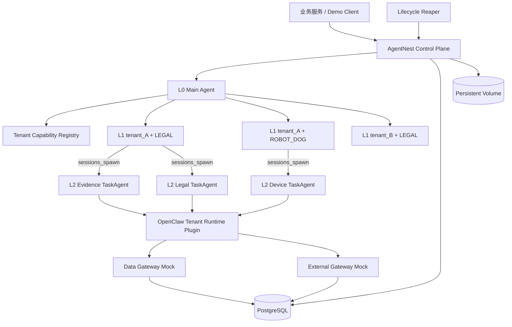

# AgentNest

AgentNest 是一个基于 **OpenClaw 官方最新稳定版**的三层多租户 Agent Demo，用于验证：

- L0 `Main Agent` 负责平台级路由；
- L1 `TenantBizAgent` 以 `tenant_id + biz_domain` 作为隔离边界；
- L2 `TaskAgent` 由 L1 使用原生 `sessions_spawn` 创建；
- L2 的 Skill、Tool、action 和 Memory Scope 只能是 L1 的子集；
- Skill、Tool、Memory、Session 和 workspace 不跨租户或业务域；
- L1 空闲 24 小时后卸载运行态，L2 空闲 1 小时后卸载运行态；
- 卸载前持久化 Session Summary、Memory、Trace 和 TaskState；
- 后续请求可以创建新的 runtime instance 并恢复必要状态。

> 这是技术验证 Demo，不是生产级零信任、IAM、审计或高可用平台。优先完成真实 OpenClaw 三层链路和最小隔离闭环。

## 当前实现状态

Phase 2 的精简 Tenant Capability Profile、任务能力交集和 PostgreSQL Runtime Registry 已落地。Phase 3 已在远端安装并启动 OpenClaw stable `2026.6.11 (e085fa1)`，配置并观察到固定 L0、3 个 L1 和 3 个 L2 的独立 Profile、workspace、agentDir 与 Skill/Tool allowlist。Phase 4 已实现 PostgreSQL `execution_context`、原生 OpenClaw Tenant Runtime Plugin、Data/External Gateway Mock 和 6 个确定性 Tool；本地隔离测试证明跨业务、跨租户、action、resource、未知/过期 context 均被拒绝且无副作用，并写入可关联 `DENY` Trace。Phase 5 已实现 PostgreSQL Task/Memory/Summary/Trace/Checkpoint Store、本地持久化 volume、1h/24h fake-clock Reaper、恢复和 Tool write-once，并接入 stable Gateway 的 Session create/history/archive 与 L1 Profile 停用；本地 Gate 为 `PASS_LOCAL`。真实 PostgreSQL 16、远端服务装配、重启恢复和三层模型链路仍属于 Phase 6，其中模型调用当前受百炼 `400 Arrearage` 账号账务状态阻断，尚不得宣称 Demo 完成。证据见 [`artifacts/reports/phase-3-summary.md`](artifacts/reports/phase-3-summary.md)、[`artifacts/reports/phase-4-summary.md`](artifacts/reports/phase-4-summary.md) 和 [`artifacts/reports/phase-5-summary.md`](artifacts/reports/phase-5-summary.md)。

## OpenClaw 基线

只使用官方 stable channel。部署时必须重新解析并记录实际稳定版本，禁止 beta、alpha、RC、dev 和未发布 `main` 特性。

当前远端记录：`OpenClaw 2026.6.11 (e085fa1)`，Schema SHA-256 `d94f740aae95abfb2d54137737d390c114b9e89cf83f0ef5796da2cf05899b29`。

官方参考：

- https://github.com/openclaw/openclaw/releases
- https://docs.openclaw.ai/concepts/multi-agent
- https://docs.openclaw.ai/tools/subagents
- https://docs.openclaw.ai/tools/skills
- https://docs.openclaw.ai/concepts/session
- https://docs.openclaw.ai/gateway/configuration

## 架构



## OpenClaw 映射

| 逻辑层 | 推荐实现 | 隔离重点 |
|---|---|---|
| L0 Main Agent | 固定 `main` Profile | 只拥有租户路由和 Agent 管理能力 |
| L1 TenantBizAgent | 独立 OpenClaw Agent Profile | 独立 workspace、agentDir、Session、Skill/Tool allowlist、Memory namespace |
| L2 TaskAgent | 原生 `sessions_spawn` Sub-agent | 独立任务 Session，权限为 L1 子集 |

L1 不能只靠 Prompt 模拟隔离。

## Demo 安全基线

第一版使用最小、可验证的安全机制：

1. 所有 Task、Memory、Trace、Session 和 Demo Resource 查询强制携带 `tenant_id + biz_domain`；
2. L1/L2 使用显式 Skill/Tool allowlist；
3. Control Plane 在 PostgreSQL 创建随机 UUID `execution_context_id`；
4. Gateway Mock 通过 ID 读取服务端权威 Tool/action/resource scope；
5. Gateway 不相信模型或 Tool body 自报的 tenant/biz；
6. 越权调用必须被拒绝、不能产生业务副作用，并记录 `DENY` Trace；
7. workspace/agentDir 路径由稳定 hash ID 派生并做根目录校验；
8. `config.txt`、模型 Key、SSH 凭证禁止进入 Git 和日志。

第一版**不实现**：

```text
Capability Token/JWT/PASETO
PKI/mTLS/完整 IAM
Redis/MinIO/Kafka/Outbox
分布式锁与多节点 HA
向量数据库
审计 hash chain
Kubernetes
生产计费、配额和大规模压测
```

这些只作为后续生产化建议。

## 最小 Demo Scope

```text
tenant_A + LEGAL
tenant_A + ROBOT_DOG
tenant_B + LEGAL
```

两个 LEGAL 租户都拥有 `case_001`，用于验证系统不能只按资源 ID 查询。

必须验证：

1. 同一 tenant/biz 复用同一 logical L1；
2. 不同 scope 使用不同 Profile、workspace、agentDir、Session；
3. LEGAL 看不到 ROBOT_DOG Skill/Tool，反之亦然；
4. L2 权限不超过 L1；
5. Memory 不跨 tenant/biz；
6. L2 TTL 卸载前状态持久化；
7. L1 TTL 卸载并可恢复；
8. 恢复后 logical ID 不变、runtime ID 改变；
9. 至少一条任务真实经过 OpenClaw L0 → L1 → L2 → Mock Tool。

## 技术栈

```text
Node.js 24
TypeScript strict
pnpm
Fastify
PostgreSQL 16
Vitest
Docker Compose
OpenClaw stable
```

第一版 Transcript/Checkpoint 可存到本地持久化 volume，不要求对象存储。

## 文档导航

- [`AGENTS.md`](AGENTS.md)：最高优先级开发约束
- [`CODEX_TASK.md`](CODEX_TASK.md)：阶段实施任务书
- [`docs/architecture.md`](docs/architecture.md)：三层 Agent 架构
- [`docs/contracts.md`](docs/contracts.md)：接口与数据契约
- [`docs/security-isolation.md`](docs/security-isolation.md)：Demo 最小隔离基线
- [`docs/lifecycle-persistence.md`](docs/lifecycle-persistence.md)：生命周期与恢复
- [`docs/implementation-plan.md`](docs/implementation-plan.md)：代码模块建议
- [`docs/deployment-runbook.md`](docs/deployment-runbook.md)：云端部署，支持 SSH key 或用户名密码
- [`docs/validation-test-plan.md`](docs/validation-test-plan.md)：测试方案
- [`docs/acceptance-checklist.md`](docs/acceptance-checklist.md)：验收清单
- [`docs/codex-kickoff-prompt.md`](docs/codex-kickoff-prompt.md)：可直接交给 Codex 的提示词
- [`docs/remote-preflight-recovery.md`](docs/remote-preflight-recovery.md)：Codex 跑偏或远端 preflight 卡住时的收口指令

## 本地机密配置

```bash
cp config.example.txt config.txt
chmod 600 config.txt
```

`config.txt` 和 `.env` 已被 Git 忽略。脚本、日志、Issue 和测试报告不得输出密码、私钥、模型/API Key 或完整连接串。

支持两种 SSH 登录方式：

```text
SSH_AUTH_MODE=key
SSH_PRIVATE_KEY_PATH=/path/to/key
```

或：

```text
SSH_AUTH_MODE=password
SSH_PASSWORD=<server password>
```

用户名密码模式是本 Demo 明确支持的方式。部署脚本应通过环境变量、stdin、`sshpass -e` 或 Node SSH library API 传递密码，不得因为缺少私钥而阻塞，也不得把密码放进命令行参数或日志。

## Codex 已在旧版安全方案上跑偏时

不要继续旧版 signed-token Phase 2。先保存旧工作到 backup 分支，拉取最新 `origin/main`，再按 [`docs/remote-preflight-recovery.md`](docs/remote-preflight-recovery.md) 收口。旧代码只迁移通用工程骨架，不整批迁移 Capability Token、revocation、replay、Redis、MinIO 或 Outbox 实现。

## 最终命令目标

```bash
pnpm install
pnpm lint
pnpm typecheck
pnpm test
pnpm demo:preflight
pnpm demo:deploy
pnpm demo:status
pnpm demo:verify
```
