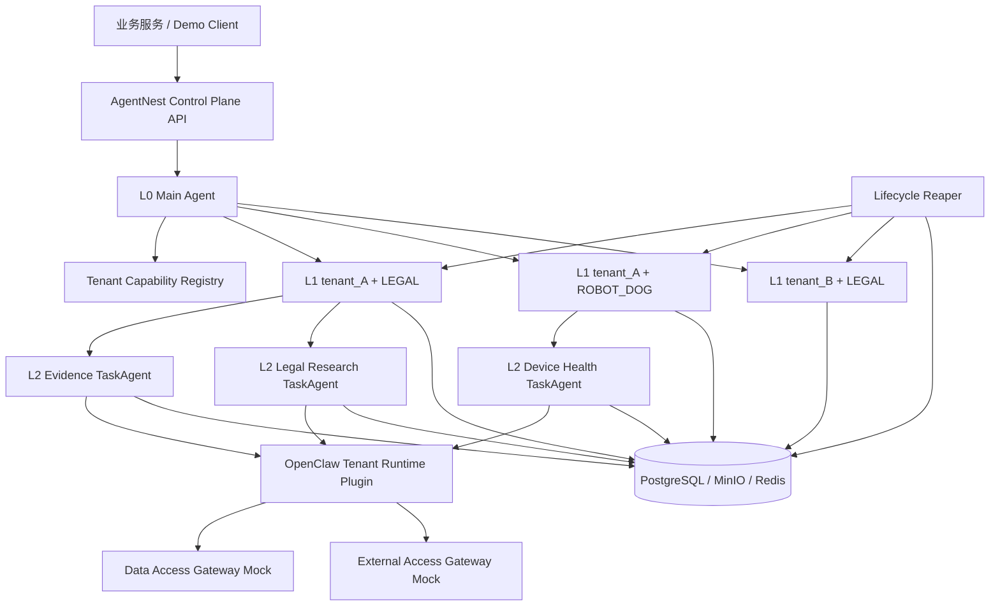

# AgentNest

AgentNest 是一个基于 **OpenClaw 最新稳定版**进行二次开发的多租户三层 Agent Demo，用于验证：

- L0 `Main Agent` 负责平台级路由；
- L1 `TenantBizAgent` 以 `tenant_id + biz_domain` 为强隔离边界；
- L2 `TaskAgent` 继承 L1 权限的子集，执行真实业务；
- Skill、Tool、Memory、Session、Trace、数据访问范围均不能跨租户或跨业务域；
- L1 空闲 24 小时后卸载运行态，L2 空闲 1 小时后归档运行态；
- 卸载前必须持久化 Session、Memory、Trace、TaskState，随后可以恢复为新的运行实例。

> 本仓库当前首先提供 Codex 开发约束、架构契约、部署约束和完整验证方案。Codex 必须按阶段逐步补齐代码、自动化部署与测试，不得绕过验收门槛。

## OpenClaw 基线

截至 2026-07-11，OpenClaw 官方 releases 页面中最新稳定版为 `v2026.6.11`，更新的 `v2026.7.1-beta.*` 属于预发布版。本 Demo 默认基线：

```text
OPENCLAW_CHANNEL=stable
OPENCLAW_VERSION=2026.6.11
```

Codex 在远端部署前必须再次从 OpenClaw 官方 releases 或 npm `latest` dist-tag 验证最新稳定版，排除 `beta`、`dev`、RC 和任意预发布版本，并将最终版本、tag、commit、安装来源写入部署清单。

官方参考：

- https://github.com/openclaw/openclaw/releases
- https://docs.openclaw.ai/concepts/multi-agent
- https://docs.openclaw.ai/tools/subagents
- https://docs.openclaw.ai/tools/skills
- https://docs.openclaw.ai/concepts/session
- https://docs.openclaw.ai/gateway/configuration

## 目标架构



## OpenClaw 映射

| 逻辑层 | 推荐实现 | 关键隔离 |
|---|---|---|
| L0 Main Agent | 固定 `main` Agent Profile | 只拥有租户路由与 Agent 管理能力 |
| L1 TenantBizAgent | 动态创建/激活的独立 OpenClaw Agent Profile | 独立 workspace、agentDir、session store、Skill allowlist、Tool policy、Memory namespace |
| L2 TaskAgent | L1 通过原生 `sessions_spawn` 创建的 Sub-agent | 独立任务 Session，只继承父级权限子集 |

L1 不允许仅用 Prompt 模拟隔离。必须利用 OpenClaw 每 Agent 独立 workspace、agentDir、Session Store、Skill allowlist、Tool allow/deny，并在 Gateway 层再次强校验。

## 目录导航

- [`AGENTS.md`](AGENTS.md)：Codex 必须遵守的最高优先级开发约束
- [`CODEX_TASK.md`](CODEX_TASK.md)：开发任务、阶段和交付物
- [`docs/architecture.md`](docs/architecture.md)：完整架构及模块职责
- [`docs/contracts.md`](docs/contracts.md)：接口、状态和权限契约
- [`docs/security-isolation.md`](docs/security-isolation.md)：租户、业务、Skill、Tool、Memory 隔离规则
- [`docs/lifecycle-persistence.md`](docs/lifecycle-persistence.md)：生命周期、持久化与恢复
- [`docs/implementation-plan.md`](docs/implementation-plan.md)：分阶段开发方案
- [`docs/deployment-runbook.md`](docs/deployment-runbook.md)：基于 `config.txt` 的云端部署规范
- [`docs/validation-test-plan.md`](docs/validation-test-plan.md)：自动化验证与故障测试方案
- [`docs/acceptance-checklist.md`](docs/acceptance-checklist.md)：最终验收清单
- [`docs/openclaw-baseline.md`](docs/openclaw-baseline.md)：OpenClaw 兼容基线与禁止项

## 机密配置

仓库是公开的。真实云服务器、SSH、模型密钥和 API 凭证只能写入本地 `config.txt` 或本地 `.env`，两者均被 `.gitignore` 排除。

```bash
cp config.example.txt config.txt
```

任何脚本、日志、测试报告、部署清单和提交都不得输出密钥、私钥、密码、完整 Token 或带凭证 URL。

## Demo 最小范围

必须至少准备：

```text
tenant_A + LEGAL
tenant_A + ROBOT_DOG
tenant_B + LEGAL
```

并验证：

1. 同一 `tenant_id + biz_domain` 复用同一逻辑 L1；
2. 不同租户或业务域得到不同 L1、workspace、agentDir、Session 和 Memory namespace；
3. LEGAL 看不到 ROBOT_DOG Skill/Tool，反之亦然；
4. L2 只能获得 L1 能力的子集；
5. 伪造 Tool 调用在 Gateway 层被拒绝；
6. L2 空闲超时后持久化并卸载；
7. L1 空闲超时后持久化并卸载；
8. 重建后恢复摘要、Memory、Trace 与未完成任务状态；
9. OpenClaw Gateway 重启后无“幽灵 Agent”，可由持久化状态恢复；
10. 所有测试可通过缩短 TTL 或注入测试时钟完成，禁止真的等待 1 小时或 24 小时。

## 非目标

第一版 Demo 不追求：

- 生产级计费、HA、多区域部署；
- 修改 OpenClaw 核心模型循环；
- 使用 beta/dev OpenClaw 特性；
- 接入真实法律、设备或企业数据；
- 把 Prompt 当成安全边界。
