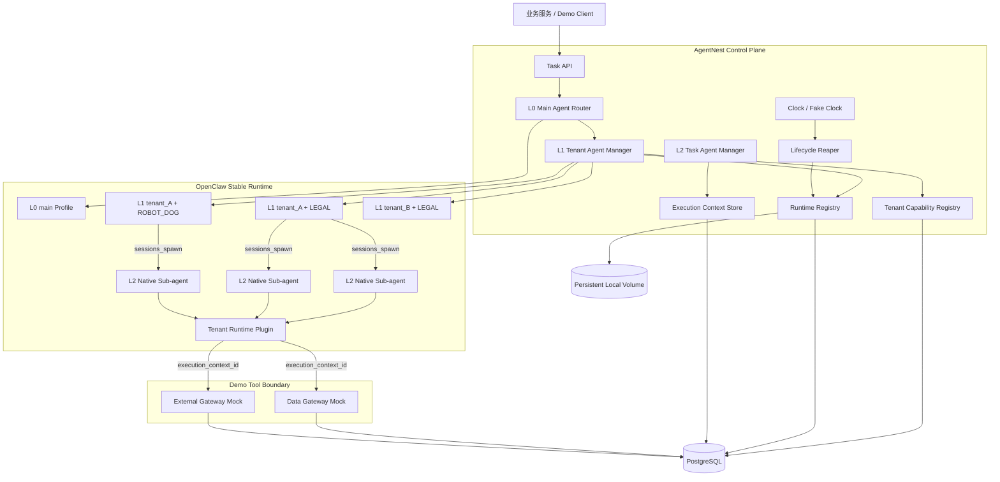

# AgentNest 三层 Agent Demo 架构

## 1. 架构目标

AgentNest 基于 OpenClaw 官方稳定版，验证：

```text
L0 Main Agent
  └─ L1 TenantBizAgent (tenant_id + biz_domain)
       └─ L2 TaskAgent
```

租户是第一隔离边界，业务域是租户内第二隔离边界：

```text
tenant_id → biz_domain → agent/session/task/memory/resource
```

本项目是 Demo，不建设生产级零信任、分布式高可用或复杂审计平台。

---

## 2. 总体架构



第一版只需要：

- OpenClaw；
- AgentNest Control Plane；
- PostgreSQL；
- 本地持久化 volume；
- 两个 Gateway Mock。

不要求 Redis、MinIO、Kafka、Outbox 或向量数据库。

---

## 3. OpenClaw 映射

| 逻辑层 | OpenClaw 实现 | 主要职责 |
|---|---|---|
| L0 Main Agent | 固定 `main` Agent Profile | tenant/biz 路由与 L1 ensure/dispatch |
| L1 TenantBizAgent | 独立 Agent Profile | workspace、Session、Skill、Tool、Memory 隔离 |
| L2 TaskAgent | L1 通过 `sessions_spawn` 创建的 Sub-agent | 执行具体业务任务 |

L1 不使用普通 Sub-agent，是因为它是较长生命周期的租户业务沙箱，需要独立 Profile、workspace、agentDir 和 Session namespace。

L2 是任务级实体，适合映射到原生 Sub-agent。

---

## 4. L0 Main Agent

### 职责

- 接收标准任务目标；
- 解析 `tenant_id`、`biz_domain`、`task_type`；
- 校验该 Demo scope 是否存在；
- ensure/activate L1；
- 将任务发送给 L1；
- 写平台级 Trace。

### 约束

- 不加载 LEGAL 或 ROBOT_DOG Skill；
- 不读取业务 Memory；
- 不调用业务 Tool；
- 不直接执行证据分析或设备健康分析。

### 最小 Tool

```text
tenant_agent_ensure
tenant_agent_dispatch
tenant_agent_status
```

---

## 5. L1 TenantBizAgent

### 身份

```text
logical_key = (tenant_id, biz_domain)
logical_agent_id = tb_<stable hash>
```

### 独立资源

```text
runtime/tenants/<logical_agent_id>/workspace
runtime/tenants/<logical_agent_id>/agent
runtime/tenants/<logical_agent_id>/sessions
runtime/tenants/<logical_agent_id>/memory
```

### 职责

- 加载该 tenant/biz 的 Capability Profile；
- 配置 Skill allowlist；
- 配置 Tool allowlist；
- 配置 Memory namespace；
- 接收业务任务；
- 按任务模板收窄 L2 能力；
- 通过 `sessions_spawn` 创建 L2；
- 汇总 L2 结果；
- 响应 checkpoint、unload 和 restore。

### 逻辑实例与运行实例

```text
logical_agent_id: 稳定
runtime_instance_id: 每次重新激活/恢复都变化
```

这样可以证明“同一个租户业务逻辑 Agent”在运行态卸载后能够重新创建。

---

## 6. L2 TaskAgent

### 创建

L1 使用 OpenClaw 原生 `sessions_spawn`，默认独立 Session。

### 职责

- 执行单一任务；
- 只加载任务需要且 L1 允许的 Skill；
- 只看到任务需要且 L1 允许的 Tool；
- 调用 Gateway Mock；
- 保存 TaskState、Memory、Trace 和结果；
- 完成或空闲后 checkpoint/unload。

### 权限继承

```text
L2.skills       = L1.skills ∩ task_template.skills
L2.tools        = L1.tools ∩ task_template.tools
L2.tool_actions = L1.tool_actions ∩ task_template.tool_actions
L2.memory_scope = L1.memory_scope ∩ task_template.memory_scope
```

不实现通用授权语言，也不实现签名 Capability Token。

---

## 7. Tenant Capability Registry

用于保存 Demo 中每个 tenant/biz 开通的能力。

### Demo 配置

```text
tenant_A + LEGAL
  skill: legal-evidence-check
  tools:
    legal_case_read/read
    legal_analysis_write/write
    legal_research_query/query

tenant_A + ROBOT_DOG
  skill: robot-dog-health-check
  tools:
    robot_device_read/read
    robot_health_write/write
    robot_telemetry_enrich/query

tenant_B + LEGAL
  skill: legal-evidence-check
  tools:
    legal_case_read/read
    legal_analysis_write/write
    legal_research_query/query
```

L1 激活时读取配置并保存一个版本化 Capability Profile 副本，便于调试和恢复追踪。

该 Profile 不需要签名、nonce 或 revoke 系统。

---

## 8. 服务端 Execution Context

L2 创建时，Control Plane 在 PostgreSQL 写入：

```text
execution_context_id = random UUID
tenant_id
biz_domain
logical_agent_id
runtime_instance_id
session_id
task_id
allowed_skills
allowed_tools + actions
resource_scope
expires_at
```

Tenant Runtime Plugin/Adapter 调 Gateway Mock 时只发送 `execution_context_id` 和本次 Tool 调用信息。

Gateway 读取服务端 context，并进行：

1. context 存在且未过期；
2. Tool/action 在 allowlist；
3. resource 在 scope；
4. 使用 context 中的 tenant/biz 查询数据；
5. 记录 ALLOW/DENY Trace。

模型 body 中自报的 tenant/biz 不作为授权事实。

---

## 9. Gateway Mock

### Data Gateway Mock

```text
legal_case_read/read
legal_analysis_write/write
robot_device_read/read
robot_health_write/write
```

### External Gateway Mock

```text
legal_research_query/query
robot_telemetry_enrich/query
```

Mock Handler 必须产生可检查的业务副作用，例如写 PostgreSQL 分析结果，才能验证越权请求没有修改数据。

Gateway Mock 只用于技术验证，不实现生产 API Gateway、计费、限流、熔断或复杂认证。

---

## 10. 持久化

### PostgreSQL

保存：

```text
tenant/biz capability config
logical agent
runtime instance
execution context
task state
memory
session summary index
trace
demo resources and results
```

### 本地持久化 volume

保存较大的 Session Transcript、checkpoint JSON 和演示结果文件：

```text
runtime/persistence/<logical_agent_id>/sessions/<session_id>.jsonl
runtime/persistence/<logical_agent_id>/checkpoints/<task_id>.json
```

不要求 MinIO。路径访问由服务端逻辑 ID 派生和校验。

### 运行时缓存

允许 Control Plane 使用进程内 `Map` 缓存活跃 Agent 对象，但 PostgreSQL 仍保存逻辑状态。进程重启后 cache 可重建。

---

## 11. 生命周期

### L1

```text
ACTIVE → IDLE → CHECKPOINTING → UNLOADED
UNLOADED → PROVISIONING → ACTIVE
```

默认空闲 TTL：24 小时。

卸载前：

- 无活动 L2；
- 保存 Session Summary、Memory、Trace 和能力配置摘要；
- 持久化成功；
- 再从运行注册表/OpenClaw 活跃配置卸载。

### L2

```text
QUEUED → RUNNING → COMPLETED/FAILED → CHECKPOINTED → UNLOADED
```

默认空闲 TTL：1 小时。任务完成后可以立即 checkpoint，不需要一直驻留一小时。

测试使用 fake clock。

---

## 12. 恢复

新任务到来时：

1. 根据 tenant/biz 查 logical L1；
2. 如果有健康 ACTIVE runtime，直接复用；
3. 否则生成新的 `runtime_instance_id`；
4. 读取当前 tenant/biz Capability Profile；
5. 重建 workspace/Profile；
6. 读取最近 Session Summary、Memory、Trace 索引和未完成 TaskState；
7. 创建新 Session；
8. 写 `restored_from_runtime_instance_id`；
9. 设置 ACTIVE。

不自动把完整历史 Transcript 注入模型。

---

## 13. Demo 非目标

以下只作为未来生产化建议：

```text
Capability Token/JWT/PASETO
PKI/mTLS/完整 IAM
Redis/MinIO/Kafka/Outbox
分布式锁、多节点 HA
向量数据库
审计 hash chain
Kubernetes
生产计费、配额和大规模压测
```

架构选择应优先回答：它是否直接用于证明三层 Agent Demo？如果不是，不在第一版实现。
