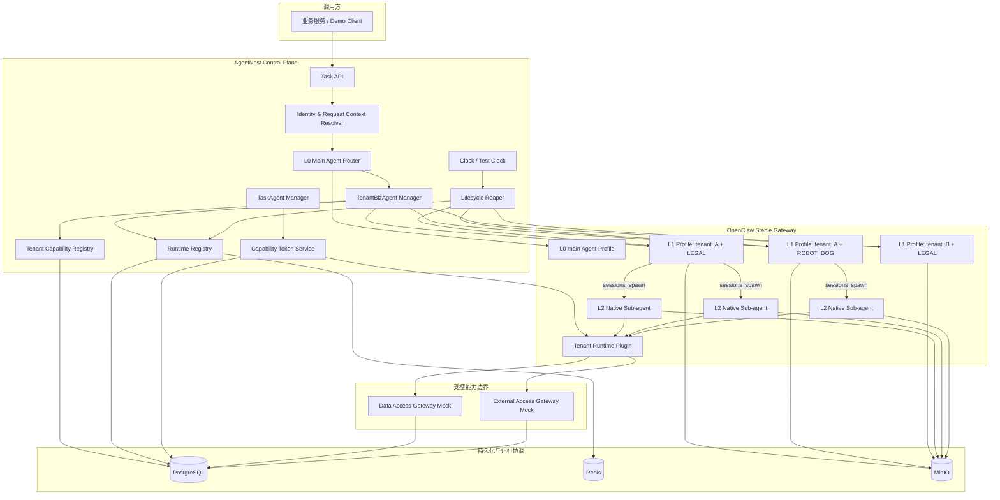
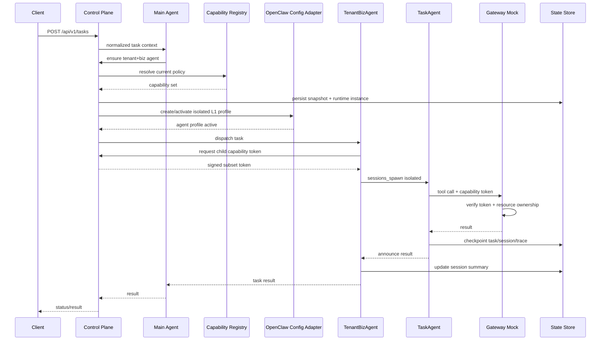
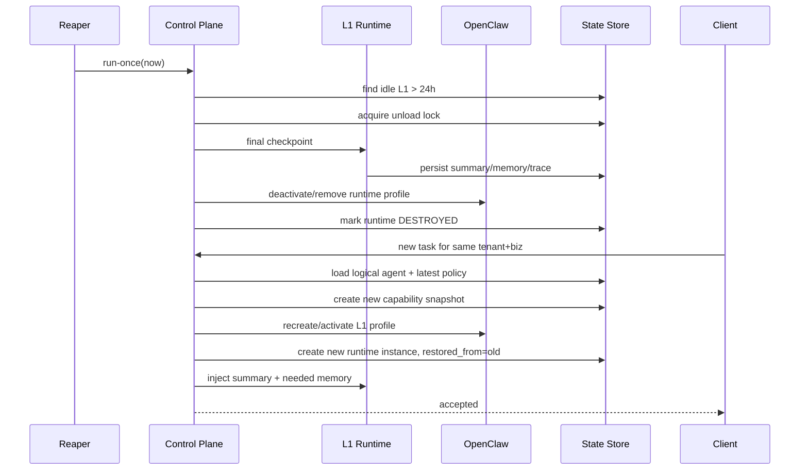

# AgentNest 三层 Agent 架构

## 1. 架构目标

AgentNest 用 OpenClaw 作为 Agent Runtime，增加一个外置的多租户控制面，验证以下逻辑模型：

```text
L0 Main Agent
  └─ L1 TenantBizAgent(tenant_id + biz_domain)
       └─ L2 TaskAgent
```

租户是第一隔离边界，业务域是租户内第二隔离边界：

```text
tenant_id → biz_domain → agent/session/task/resource
```

任何只按 `biz_domain`、`agent_id` 或 `session_id` 隔离的实现都不满足本方案。

---

## 2. 总体架构图



---

## 3. 为什么 L1 使用独立 OpenClaw Agent Profile

OpenClaw 的一个配置 Agent 原生拥有独立的：

- workspace；
- `agentDir`；
- Session Store；
- Agent 配置；
- Skill allowlist；
- Tool policy；
- Sandbox policy。

因此 L1 采用独立 Agent Profile，可以把 `tenant_id + biz_domain` 映射为真实运行时边界，而不是只靠 Prompt。

L1 不直接采用普通 Sub-agent 的原因：

1. L1 是租户业务沙箱，而不是一次性任务；
2. L1 需要独立 workspace、agentDir、Session Store 和 Skill materialization；
3. OpenClaw 原生 Sub-agent auto-archive 默认 60 分钟，并且深度 1/2 使用同一规则；
4. L1 24 小时 TTL 应由 AgentNest Lifecycle Reaper 管理；
5. L2 才是最适合映射到 OpenClaw 原生 Sub-agent 的任务级实体。

逻辑上的“Main Agent 派生 L1”由 Control Plane 的 `ensure/activate/dispatch` 完成：首次请求动态创建 Profile，后续请求复用同一个逻辑 L1。

---

## 4. L0 Main Agent

### 4.1 职责

- 接收标准化后的任务目标；
- 识别 `tenant_id`、`biz_domain`、`task_type`；
- 校验租户是否开通对应业务域；
- 请求 Control Plane ensure/activate L1；
- 将任务派发给 L1；
- 维护平台级 Trace；
- 返回任务受理结果。

### 4.2 明确禁止

- 不加载业务 Skill；
- 不直接读取业务 Memory；
- 不调用 Data/External 业务 Tool；
- 不直接执行证据链分析、机器狗健康分析等具体任务；
- 不允许使用租户模型输入覆盖可信身份上下文。

### 4.3 最小 Tool 集

```text
tenant_agent.ensure
tenant_agent.dispatch
tenant_agent.status
```

---

## 5. L1 TenantBizAgent

### 5.1 身份

```text
logical_key = (tenant_id, biz_domain)
logical_agent_id = tb_<stable hash>
```

### 5.2 职责

- 作为租户业务域的 Agent 沙箱；
- 加载 Capability Snapshot；
- 加载最终 Skill allowlist；
- 加载 Tool Registry View；
- 配置 Memory namespace；
- 配置 Sandbox；
- 接收业务任务；
- 根据 task template 计算 L2 能力子集；
- 派生 L2；
- 接收 L2 announce，汇总结果；
- 维护 Session Summary；
- 响应 checkpoint/unload。

### 5.3 独立资源

每个 L1 必须使用：

```text
runtime/tenants/<logical_agent_id>/workspace
runtime/tenants/<logical_agent_id>/agent
runtime/tenants/<logical_agent_id>/sessions
runtime/tenants/<logical_agent_id>/memory
```

实际目录可以由 OpenClaw state dir 管理，但绝不能与另一个 L1 复用。

### 5.4 运行实例

逻辑 L1 与进程内实例分离：

```text
logical_agent_id: 稳定
runtime_instance_id: 每次激活/恢复都变化
```

这使卸载后恢复可追踪，而不会把旧实例误当作仍然存活。

---

## 6. L2 TaskAgent

### 6.1 创建

L1 使用：

```text
sessions_spawn
context = isolated
cleanup = keep
```

任务完成后 AgentNest 立即 checkpoint。最终归档由 L2 Reaper 与 OpenClaw auto-archive 协同完成。

### 6.2 职责

- 执行单一明确任务；
- 仅加载任务要求且父级允许的 Skill；
- 使用短期 Capability Token 调用 Tool；
- 写 TaskState、Trace、Tool Call；
- 生成结构化结果和 Artifact；
- 在完成、失败或等待输入时 checkpoint。

### 6.3 权限继承

```text
L2_effective_capabilities
  = L1_snapshot
  ∩ task_template
  ∩ latest_tenant_policy
```

L2 不允许动态请求扩大权限。需要额外权限时，必须结束当前 Task，由业务层重新提交新的授权任务。

---

## 7. Tenant Capability Registry

分为两层：

### 7.1 Global Catalog

定义平台有哪些能力：

```text
Skill Definition
Tool Definition + Actions
Memory Scope Definition
Data Scope Definition
Task Template
Sandbox Profile
```

### 7.2 Tenant-Business Binding

定义某租户某业务域开通哪些能力：

```text
tenant_A + LEGAL
  skills: legal-evidence-check
  tools: legal.case.read, legal.analysis.write

tenant_A + ROBOT_DOG
  skills: robot-dog-health-check
  tools: robot.device.read, robot.health.write
```

L1 创建时从 Binding 生成不可变 Snapshot。

---

## 8. Tenant Runtime Plugin

插件运行在 OpenClaw Tool 注册和执行边界，负责：

1. 依据当前 Agent/Session 找到 Capability Context；
2. 对模型可见 Tool Definition 做过滤；
3. 在 Tool 请求中注入签名运行上下文；
4. 在执行前检查 tool/action 是否允许；
5. 将调用发送到 Data/External Gateway；
6. 写本地 Trace hook；
7. 返回结构化 ToolResult。

插件不是唯一安全边界。Gateway 必须独立验签和鉴权。

---

## 9. Data/External Gateway Mock

Demo 使用 Mock Gateway 验证访问控制，而不是依赖真实法律或 IoT 服务。

### Data Gateway Mock

提供：

```text
legal.case.read
legal.analysis.write
robot.device.read
robot.health.write
```

所有资源都存储 `tenant_id + biz_domain`，并执行资源归属校验。

### External Gateway Mock

提供：

```text
legal.research.query
robot.telemetry.enrich
```

验证外部 Tool 同样受 Capability Token、租户、业务、action 和配额约束。

---

## 10. 持久化组件

### PostgreSQL

权威保存：

- tenant/biz 配置；
- capability catalog/binding/snapshot；
- logical agent；
- runtime instance；
- task state；
- session snapshot index；
- memory index/summary；
- trace event；
- tool call audit；
- idempotency；
- outbox。

### Redis

保存可丢失并可重建的短期数据：

- ensure 分布式锁；
- runtime heartbeat；
- active instance cache；
- token nonce/revocation cache；
- short-lived idempotency cache。

Redis 不是权威状态源。

### MinIO

保存：

- Transcript JSONL 快照；
- 大模型上下文摘要附件；
- Tool 大响应；
- Task Artifact；
- 测试证据包。

对象路径必须以租户和业务域为逻辑前缀，或者使用不可猜测 ID 加数据库映射；无论采用哪种方式，访问必须经 Gateway，不允许模型直接持有 MinIO 管理凭证。

---

## 11. 关键调用序列

### 11.1 首次创建 L1 并派生 L2



### 11.2 L1 超时卸载与恢复



---

## 12. 部署拓扑

Demo 默认单机 Docker/进程混合部署：

```text
OpenClaw Gateway      127.0.0.1:18789
AgentNest Control     private network:18080
Data Gateway Mock     private network:18081
External Gateway Mock private network:18082
PostgreSQL            private network
Redis                 private network
MinIO                 private network
```

外部验证通过 SSH tunnel。除非 `config.txt` 明确配置安全入口并经过测试，否则禁止把 OpenClaw Control UI、数据库、Redis、MinIO Console 或 Admin API 暴露公网。

---

## 13. 架构边界验收

架构只有在以下条件下才成立：

- L1 是真实独立 Profile，而非同一 Agent 的 prompt 标签；
- `agentDir`、Session Store 和 workspace 不复用；
- Skill allowlist 是 OpenClaw 生效配置；
- Tool policy 在 OpenClaw 和 Gateway 两端都验证；
- Memory 查询在存储层带 tenant+biz filter；
- L2 Token 是父能力子集；
- 状态不依赖单进程内存；
- 超时卸载可以在进程重启后继续执行；
- 恢复不会复活已撤销权限。
