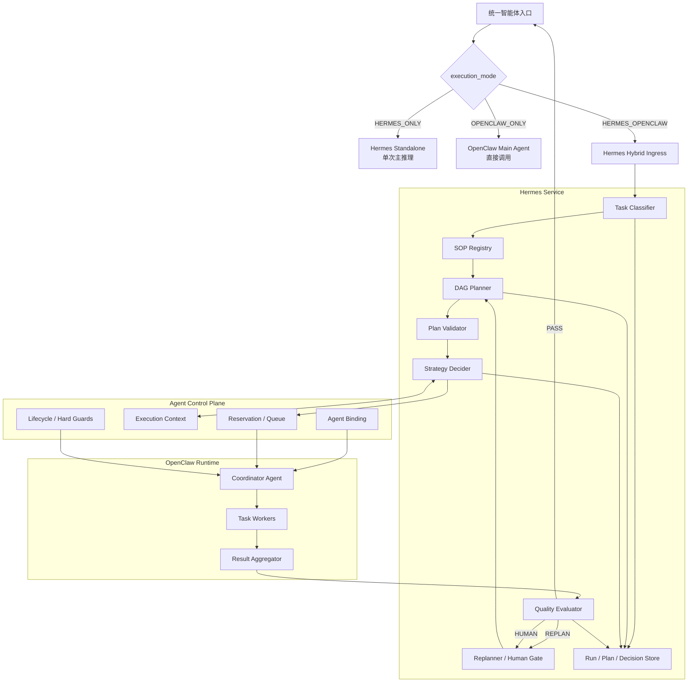
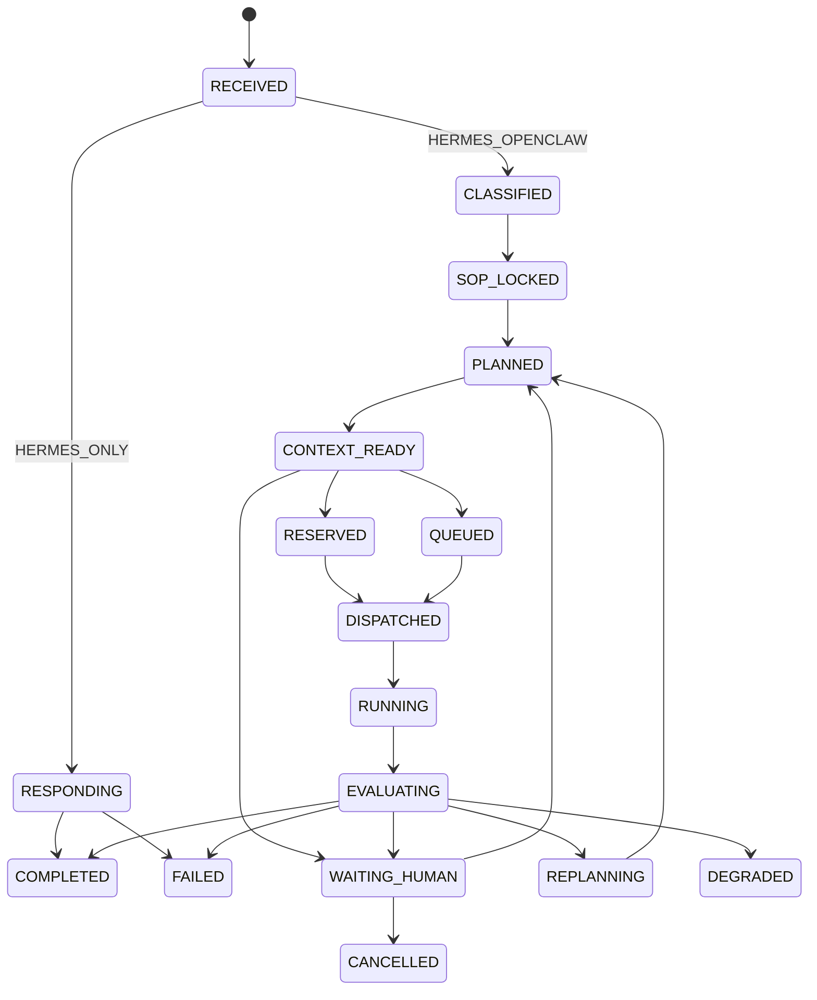

# Hermes 认知编排服务架构约束

## 1. 架构目标

Hermes 必须在不接管运行时硬约束的前提下，完成：

```text
理解任务 → 锁定 SOP → 生成 DAG → 查询真实执行条件
→ 选择策略 → 预留/派发 → 验收结果 → 完成或重规划
```

Hermes 是“业务决策大脑”，不是 Agent Runtime、资源调度器或 Tool Gateway。

---

## 2. 总体架构



图中 `OPENCLAW_ONLY` 路径不进入 Hermes Service。

---

## 3. Hermes 内部模块

| 模块 | 职责 | 禁止承担 |
|---|---|---|
| Hybrid Ingress | 校验请求、可信上下文和模式 | 业务规划、权限推断 |
| Task Classifier | 识别 biz/task、目标、约束、风险 | 覆盖可信 tenant/user |
| SOP Registry | 按 scope 找到并锁定 SOP 版本 | 把 SOP 当成授权凭证 |
| DAG Planner | 生成节点、依赖和完成标准 | 创建 Agent 或调用 Tool |
| Plan Validator | 检查无环、输入、Schema、冲突和上限 | 自动扩大 capability |
| Strategy Decider | 根据真实 context 选串/并行/排队/降级 | 虚构资源、扣减配额 |
| Control Plane Client | 调用外部原子 Tool 并映射错误 | 擅自选择业务 fallback |
| Execution Monitor | 查询/接收结构化执行状态 | 成为第二套任务队列 |
| Quality Evaluator | 对照 SOP 验收结果和证据 | 接受无 Schema 的自由文本 |
| Replanner | 生成有界差异计划 | 无限循环或全量盲重跑 |
| Human Gate | 暂停、展示理由、接收明确决定 | 自动代表用户批准高风险操作 |
| Run Store | 保存 Hermes 权威 Run/Plan/Decision | 复制 Control Plane 资源真相 |
| Model Provider | 统一模型 timeout、配置和错误 | 将供应商 SDK 泄漏到 domain |

---

## 4. 入口分流

### 4.1 `HERMES_ONLY`

```text
Ingress → ModelProvider → Schema/Policy Check → Response
```

特点：

- 不创建 DAG；
- 不加载复杂 SOP；
- 不调用 Control Plane；
- 不调用 OpenClaw；
- 不产生 reservation/execution_id；
- 只保存最小 Run、模型配置摘要和 Trace。

### 4.2 `OPENCLAW_ONLY`

```text
Unified Ingress → OpenClaw Main Agent
```

Hermes 不应收到该请求。若因错误路由收到，返回
`MODE_NOT_HANDLED_BY_HERMES`，不得代理转发。

### 4.3 `HERMES_OPENCLAW`

```text
Ingress
→ Classify
→ resolve_agent
→ lock SOP
→ plan/validate DAG
→ get_execution_context
→ decide strategy
→ reserve/enqueue
→ dispatch
→ monitor
→ evaluate
→ complete/replan/human
→ release
```

---

## 5. 领域对象

### `HermesRun`

一个用户请求在 Hermes 中的权威编排记录。

```text
run_id
request_id
trace_id
tenant_id
biz_domain
user_id
workspace_id
execution_mode
task_type
status
sop_id
sop_version
current_plan_id
external_execution_id
reservation_id
replan_attempt
created_at / updated_at
```

### `TaskDag`

描述“业务上应该执行什么”和依赖，不包含底层实例 ID。

### `ExecutionPlan`

在 DAG 基础上增加实际 strategy、parallelism、priority、timeout、
queue policy 和 fallback。

### `DecisionRecord`

保存 Hermes 为什么选择串行、并行、排队、降级或人工确认。

### `QualityEvaluation`

保存完成标准、证据、缺口、冲突和下一动作。

---

## 6. 状态机



任何状态都可以在符合取消策略时进入 `CANCELLED`。终态后必须幂等释放
reservation；释放失败记录 `release_pending` 并由恢复任务重试，不能把业务结果
倒退为未完成。

---

## 7. 外部依赖原则

Hermes 只通过端口接口依赖：

```ts
interface ModelProvider {}
interface SopRepository {}
interface HermesRunRepository {}
interface AgentControlPlaneClient {}
interface Clock {}
interface IdGenerator {}
```

测试必须可用 Fake 实现完成。未接入真实 Control Plane/OpenClaw 不能阻塞
Hermes 领域逻辑开发。

---

## 8. 持久化边界

Hermes PostgreSQL schema 只保存：

```text
hermes_sop
hermes_run
hermes_plan
hermes_plan_node
hermes_decision
hermes_evaluation
hermes_human_action
hermes_outbound_call_log（最小幂等记录）
```

Hermes 不保存：

- Agent 资源实时计数；
- Control Plane 配额权威值；
- OpenClaw Session Transcript 原件；
- 业务数据库内容；
- Tool 业务副作用；
- 其他租户的共享 Prompt Context。

---

## 9. 并发与恢复

- `request_id + tenant_id` 必须支持幂等；
- 同一 Run 的规划和重规划用乐观版本或 PostgreSQL 行锁串行化；
- 外部派发使用稳定 `dispatch_idempotency_key`；
- 恢复时先调用 `get_execution_status` 对账；
- 已被外部接收的 dispatch 不得重新创建；
- 不在 Hermes 内建立第二条常驻任务队列；
- 排队状态的权威执行顺序属于 Control Plane。

---

## 10. 可观测性

所有日志、Metric 和 Trace 至少关联：

```text
request_id
trace_id
tenant_id
biz_domain
run_id
plan_id
node_id（如适用）
external_execution_id（如适用）
decision_code
latency_ms
```

必须区分：

- Hermes 决策；
- Control Plane 事实/拒绝；
- OpenClaw 执行结果；
- Fake 与真实集成。

不得在日志中写完整 Prompt、完整模型响应、机密或未脱敏业务材料。

---

## 11. 非目标

Hermes 架构不得通过“方便实现”为理由吸收：

```text
Agent Pool / Binding Registry
资源监控、Quota、Rate Limit、Queue
OpenClaw Profile / Session / Worker 创建
Tool Registry / Tool Execute
业务数据访问
Agent checkpoint / unload / restore 状态机
```

这些系统只能通过契约被调用。
