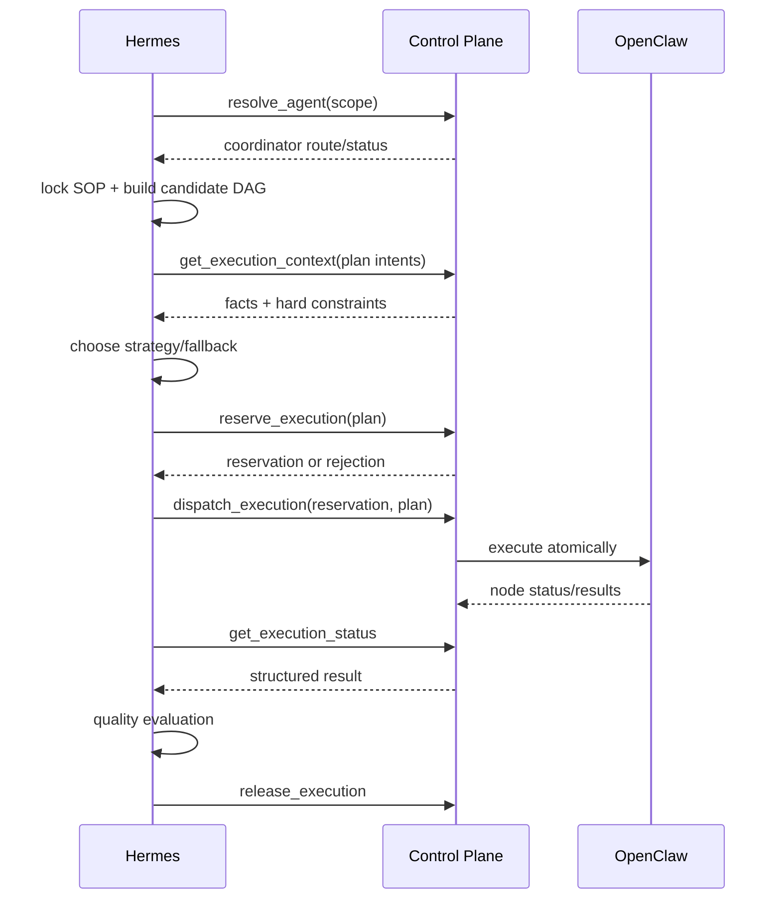

# Hermes 与 Agent Control Plane 功能边界

## 1. 核心原则

```text
Hermes：决定“业务上应该怎么做”
Control Plane：保证“平台实际上允许且能够这样做”
```

不能通过取消 Control Plane 代码约束来获得 Hermes 灵活性，也不能把业务策略
硬编码进 Control Plane。

---

## 2. 决策归属

| 决策/事实 | Hermes | Control Plane |
|---|---:|---:|
| 理解任务目标 | 是 | 否 |
| 选择 SOP | 是 | 否 |
| 拆解子任务/DAG | 是 | 否 |
| 判断业务依赖 | 是 | 否 |
| 判断并行是否值得 | 是 | 否 |
| 决定优先级和 fallback | 是 | 否 |
| 质量验收和重规划 | 是 | 否 |
| 实际 CPU/内存/GPU | 否 | 是 |
| 空闲 Agent 槽位 | 否 | 是 |
| 原子配额扣减 | 否 | 是 |
| 分布式限流 | 否 | 是 |
| reservation | 申请/使用 | 校验/创建 |
| 队列顺序和消费 | 提供意图 | 强制执行 |
| Agent 创建/恢复/销毁 | 表达意图 | 执行动作 |
| Tool 权限硬校验 | 声明意图 | 强制执行 |
| 防止资源超分 | 否 | 是 |
| 防止写冲突 | 规划期检查 | 运行期硬防护 |

---

## 3. Control Plane 应提供的事实

`get_execution_context` 至少返回：

```text
available_parallelism
tenant_remaining_slots
estimated_queue_wait_seconds
tool concurrency / rate limit
budget_remaining
capability scope
active reservation constraints
observed_at / valid_for_seconds
```

Control Plane 不返回：

```text
应该使用哪个业务 Tool
哪个法律结论更重要
是否值得等待阿里法睿
应该删除哪个必需节点
结果质量是否足够
```

---

## 4. 原子 Tool

Hermes 使用小而明确的 Tool：

| Tool | Hermes 的用途 | Control Plane 保证 |
|---|---|---|
| `resolve_agent` | 获取逻辑执行入口 | scope、binding、恢复状态真实 |
| `get_execution_context` | 获取计划条件 | 资源/配额/限流事实 |
| `reserve_execution` | 申请确定资源 | 原子性、TTL、无超分 |
| `dispatch_execution` | 下发已批准计划 | 幂等派发、状态记录 |
| `enqueue_execution` | 按策略排队 | 原子入队、公平消费、超时 |
| `get_execution_status` | 获取执行证据 | 状态真实、节点结果可关联 |
| `cancel_execution` | 取消意图 | 取消和资源回收 |
| `release_execution` | 释放 reservation | 幂等释放 |
| `hibernate_agent` | 表达可休眠意图 | checkpoint/lifecycle 状态机 |

不建议使用一个 `admit_execution_plan` 让 Control Plane 同时决定并行、排队和
业务 fallback。

---

## 5. 正确时序



---

## 6. 错误处理归属

示例：

```json
{
  "code": "TOOL_RATE_LIMITED",
  "tool": "ali_farui",
  "retry_after_seconds": 120
}
```

Control Plane 只报告事实。Hermes 根据 SOP 选择：

- 等待 120 秒；
- 先做其他节点；
- 使用本地 Legal RAG；
- 跳过可选节点；
- 返回已有依据并标记降级；
- 人工确认；
- 修改目标并 Replan。

适配器禁止在收到错误后自动切换 Tool，否则决策不可追踪。

---

## 7. Reservation

- context 快照不锁定资源；
- reservation 才表示资源被原子占用；
- reservation 必须有 TTL；
- 派发必须关联 reservation；
- 过期后不得继续派发；
- Plan 变化导致资源需求变化时必须重新 reserve；
- release 必须幂等；
- Hermes 崩溃后由恢复任务继续 release_pending；
- Control Plane 可因硬约束拒绝，但不得自动重写 Plan。

---

## 8. Agent Binding

Hermes 以可信 scope 查询：

```text
tenant_id + biz_domain + user_id + workspace_id
```

Control Plane 可能返回：

| 状态 | Hermes 处理 |
|---|---|
| `ACTIVE` | 继续规划/派发 |
| `BUSY` | 按 SOP 排队、等待、分批或失败 |
| `RESTORABLE` | 请求恢复并等待状态 |
| `ABSENT` | 请求 ensure/create 意图 |
| `DENIED` | 停止并返回 scope/权限错误 |

Hermes 不直接修改 Binding Registry。

---

## 9. 生命周期

Hermes 可以表达：

```text
任务完成后 Worker 可回收
Coordinator 可在空闲后休眠
取消后释放 reservation
```

Hermes 不执行：

```text
checkpoint
Session/Memory/Trace 持久化
runtime unload
Profile deactivate
restore instance
```

这些动作由 Control Plane/OpenClaw 状态机保证。Hermes 只保存自己的 Run/Plan/
Decision，并通过外部状态对账。

---

## 10. 禁止的反模式

- Hermes 直接读 Redis 判断槽位；
- Hermes 自己维护 Agent Pool 真相；
- Control Plane 根据 Tool 错误擅自换业务 Tool；
- 无 reservation 先 dispatch、失败后补登记；
- Hermes 把 `available_parallelism` 当永久配额；
- Control Plane 修改 required node 为 optional；
- Adapter 吞掉 `QUOTA_EXCEEDED` 后返回空结果；
- 为测试方便在 Hermes 内 fake 一个生产 Control Plane 并声称是真实链路。
