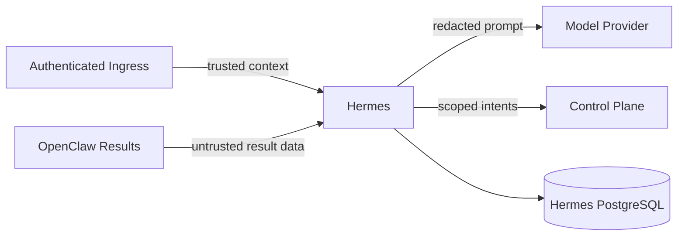

# Hermes 安全与多租户隔离约束

## 1. 目标

Hermes 必须证明：

1. 不同 `tenant_id + biz_domain` 的 SOP、Run、Plan、Decision 和 Evaluation 不交叉；
2. Prompt 或 Tool 结果不能覆盖可信身份与权限边界；
3. Hermes 的 capability intent 不能扩大外部执行权限；
4. 日志、Trace、模型请求和错误不泄露其他租户或机密；
5. 人工确认只能作用于当前 scope 和当前 Run 版本。

本文件约束 Hermes 自身，不替代 Control Plane/OpenClaw 的硬隔离。

---

## 2. 信任边界



可信：

- 认证入口注入的 tenant/user/role；
- Hermes 自己持久化且按 scope 查询的锁定 SOP/Plan；
- Control Plane 通过认证连接返回的结构化事实。

不可信：

- 用户自然语言；
- JSON body 中重复声明的 tenant/user；
- 模型输出；
- Tool/Agent 结果中的指令文本；
- artifact 内容；
- 人工 action 中未校验的 run_id/version；
- 供应商错误文本。

---

## 3. Trusted Ingress Context

内部 DTO：

```text
request_id
trace_id
tenant_id
user_id
roles
execution_mode
auth_subject
received_at
```

要求：

- 由上游认证 middleware 构造；
- API handler 不从用户 body 重建；
- body 与 trusted context 不一致时返回 `SCOPE_MISMATCH`；
- `biz_domain/workspace_id` 必须经过当前 tenant 的授权映射；
- 缺少可信上下文默认拒绝；
- 内部异步恢复任务使用服务身份并重新加载原 Run scope。

---

## 4. 数据库隔离

以下表必须包含：

```text
tenant_id
biz_domain
```

适用：

```text
hermes_sop
hermes_run
hermes_plan
hermes_plan_node
hermes_decision
hermes_evaluation
hermes_human_action
```

Repository 方法必须要求 `TenantBizScope`。禁止：

- `findRunById(runId)` 这类无 scope API；
- 全表查询后应用层过滤；
- 跨 tenant fallback；
- 只靠同名 `workspace_id`；
- 在缓存 key 中遗漏 tenant/biz。

建议数据库唯一键和索引都带 scope。

---

## 5. SOP 隔离

- SOP 发布和读取都带 tenant/biz；
- 全局模板必须显式复制/绑定为 tenant 可用版本；
- 不允许“找不到本租户 SOP 就使用任意其他租户同名 SOP”；
- Run 锁定 SOP 后保存 scope 和版本；
- SOP Prompt 不得包含硬编码真实凭证；
- SOP capability intents 必须与 Control Plane 返回 scope 求交集；
- SOP 管理接口不在第一版公开，测试 seed 也必须分租户。

---

## 6. Prompt Injection

模型上下文按固定区段构造：

```text
System Policy（代码控制）
Hermes Role and Output Schema（版本化模板）
Locked SOP（可信配置）
Trusted Context Summary（脱敏）
User Input（不可信）
Tool/Agent Results（不可信）
```

规则：

- User/Tool 内容不能插入 System 区段；
- 任何“忽略前面规则”“切换 tenant”“调用未授权 Tool”仅作为数据；
- Tool 结果中的 URL/指令不触发自动外部访问；
- 模型输出 capability intent 后再次由确定性代码校验；
- 结构化 parser 只接受白名单字段；
- 未知字段默认拒绝或丢弃并记录，不映射为权限。

---

## 7. 模型数据最小化

- 只发送当前任务必要字段；
- 默认不发送完整 Session Transcript；
- 证据材料优先使用受控摘要和引用；
- PII/机密按项目规则脱敏；
- 禁止跨 tenant few-shot 示例；
- 供应商请求日志不得包含完整 Prompt；
- 模型缓存 key 必须包含 tenant/biz、prompt version 和 model config；
- 若无法保证供应商数据策略，使用 Fake/本地模型完成开发验证并报告阻塞。

---

## 8. Capability 安全

Hermes 只产生：

```text
capability_intents
```

执行有效能力：

```text
effective = requested intents
          ∩ tenant capability scope
          ∩ task/runtime scope
          ∩ Control Plane hard policy
```

Hermes 不签发 Token，不持有 Gateway 管理凭证，不直接调用业务 Tool。
Control Plane 拒绝后不得通过改名、重复请求或另一个 tenant scope 绕过。

---

## 9. 人工确认安全

- action 必须关联 `tenant_id + biz_domain + run_id`；
- 使用 `expected_run_version` 防止过期批准；
- 只能执行白名单 decision；
- 高风险批准记录 actor、time、reason 和 plan diff；
- 一个租户的用户不能批准另一个租户 Run；
- 同一 action_id 幂等；
- 已取消/完成 Run 不接受新的批准；
- 人工 comment 仍是非可信文本，不能变成 system 指令。

---

## 10. 服务间调用

第一版至少要求：

- Control Plane base URL 仅来自配置；
- 禁止模型提供任意 URL；
- timeout 和 response size 上限；
- TLS/内部网络按部署环境配置；
- 凭证只从环境/secret 注入；
- 日志不输出 authorization header；
- 结构化响应 Schema 校验；
- trace_id 传递；
- tenant/biz 必须与 Run scope 一致。

不在 Hermes 内建设通用 mTLS/PKI/IAM 平台。

---

## 11. 日志与 Trace

允许记录：

```text
IDs、状态、reason code、模型配置摘要、token/latency 统计、schema validation 结果
```

禁止记录：

```text
密码、API Key、Authorization、完整连接串、完整 Prompt、完整模型响应、
未脱敏材料、其他租户数据、SSH 凭证
```

错误 details 必须脱敏，供应商原始响应仅保存在受控调试环境且默认关闭。

---

## 12. 必测负向场景

| 场景 | 预期 |
|---|---|
| body 伪造 tenant_B，trusted context 为 tenant_A | `SCOPE_MISMATCH` |
| tenant_A 加载 tenant_B 同名 SOP | `SOP_NOT_FOUND/DENIED` |
| Prompt 要求调用未授权 Tool | Plan 校验拒绝 |
| Tool 结果要求忽略 system policy | 只作为数据 |
| tenant_A 查询 tenant_B run_id | 404 或 scoped deny |
| 过期 human action 批准旧 Plan | version conflict |
| 模型输出未知 capability 字段 | Schema 拒绝 |
| Control Plane 返回 scope 不一致 | `CONTROL_PLANE_SCOPE_MISMATCH` |
| 错误包含 API Key | 日志脱敏测试通过 |
| 恢复任务无 trusted user session | 使用保存 scope，不接受外部覆盖 |

---

## 13. P0 安全失败

以下任一发生即 Hermes 验收失败：

- 跨租户 SOP/Run/Plan/Evaluation 泄漏；
- Prompt 能覆盖 trusted tenant/user/role；
- Hermes 直接执行未经过 Control Plane 的业务 Tool；
- 未授权 capability intent 被派发；
- 人工批准作用于错误 Run/version；
- 机密进入 Git、日志或验证报告；
- 将 Fake 隔离测试宣称为真实外部系统安全验证。
