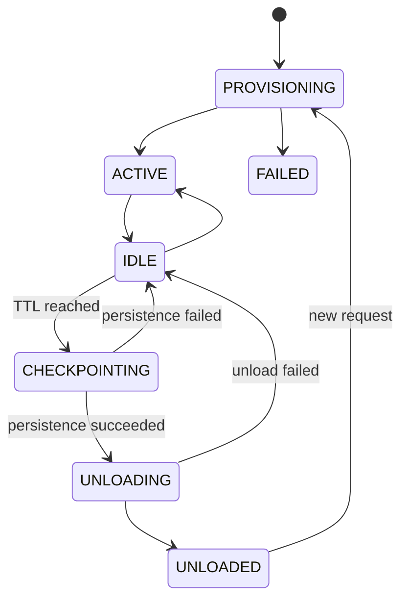
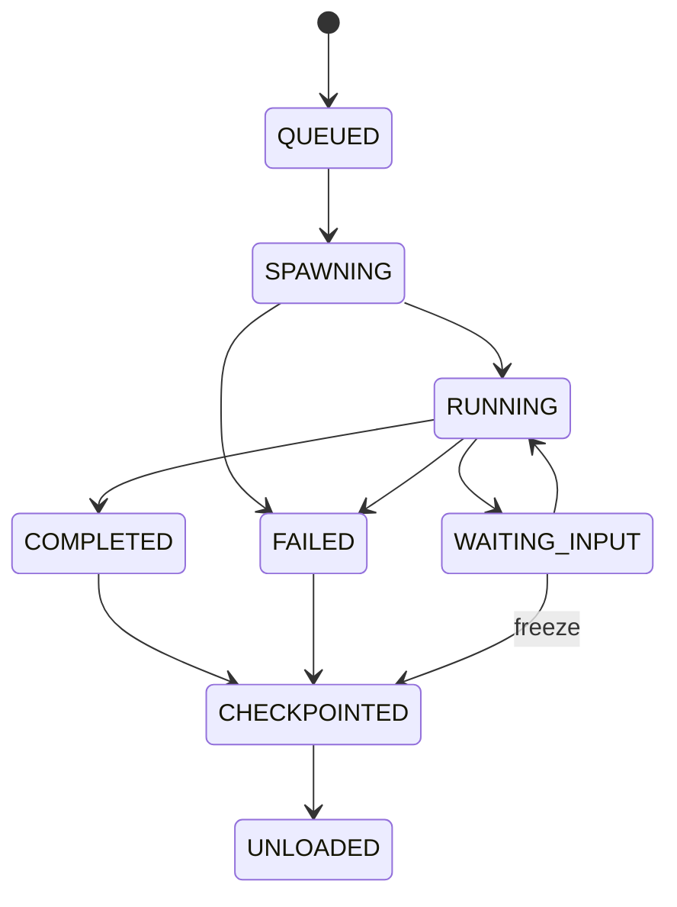

# Agent 生命周期、持久化与恢复

## 1. 核心语义

本项目中的“销毁”表示：

> 完成 checkpoint 后，从活跃 Runtime Registry 和 OpenClaw 活跃 Profile/Session 中卸载运行态，不删除历史 Session Summary、Memory、Trace、TaskState 或 Transcript 文件。

代码优先使用：

```text
checkpoint
unload
archive
restore
```

而不是含义不清的 `delete`。

本文件面向单节点 Demo，不设计分布式协调、Outbox、Redis 锁或对象存储一致性协议。

---

## 2. 生命周期参数

默认：

```text
L1 TenantBizAgent idle TTL = 86400 秒（24h）
L2 TaskAgent idle TTL      = 3600 秒（1h）
```

要求：

- 可通过环境变量覆盖；
- 测试使用 fake clock；
- 时间统一使用 UTC；
- 不允许测试真实等待 1 小时/24 小时；
- OpenClaw auto-archive 可以辅助，但 AgentNest Reaper 负责 Demo 可重复验证。

---

## 3. 活跃时间

### L1 `last_active_at`

以下行为更新：

- 接收新任务；
- 派生 L2；
- 收到 L2 完成/失败结果；
- 有效用户后续交互；
- 恢复未完成任务；
- 有业务意义的 Memory/Tool 写入。

health check、查询状态和 Reaper 扫描不更新。

### L2 `last_active_at`

以下行为更新：

- 开始或结束任务 step；
- Tool 调用开始/结束；
- 用户补充输入；
- 写 checkpoint。

任务完成后立即 checkpoint；不要求继续占用内存一小时。

---

## 4. L1 状态机



### L1 卸载条件

必须同时满足：

```text
now - last_active_at >= l1_idle_ttl
active_l2_count == 0
no task in RUNNING / SPAWNING / CHECKPOINTING
```

单节点 Demo 使用 PostgreSQL 行锁或进程内互斥防止同一个 Reaper run 重复处理即可。不实现 Redis 分布式锁。

### L1 checkpoint

步骤：

1. 状态从 `IDLE` 改为 `CHECKPOINTING`；
2. 暂停创建新的 L2；
3. 保存 Session Summary；
4. 保存 Memory；
5. 保存 Trace；
6. 保存当前 Capability Profile 摘要；
7. 保存活跃/未完成 Task 索引；
8. 保存 Transcript 文件路径；
9. 提交 PostgreSQL 事务；
10. 从 Runtime Registry 和 OpenClaw 活跃配置卸载；
11. 状态改为 `UNLOADED`。

第 3—9 步任一失败：恢复 `IDLE`，不得标记 `UNLOADED`。

---

## 5. L2 状态机



### L2 checkpoint

至少保存：

- TaskState 和 current step；
- final/intermediate result；
- Session Summary；
- Memory；
- Trace；
- Transcript 路径；
- `last_active_at`。

等待用户输入时可以立即 checkpoint 并卸载，不需要空占运行内存。

---

## 6. 最小持久化模型

### `tenant_biz_agent`

```text
logical_agent_id PK
tenant_id
biz_domain
status
current_runtime_instance_id
last_active_at
created_at
updated_at
UNIQUE(tenant_id, biz_domain)
```

### `agent_runtime_instance`

```text
runtime_instance_id PK
logical_agent_id
openclaw_agent_id
status
started_at
last_active_at
checkpointed_at
unloaded_at
restored_from_runtime_instance_id
failure_reason
```

### `agent_task`

```text
task_id PK
tenant_id
biz_domain
logical_agent_id
runtime_instance_id
l2_session_id
task_type
status
current_step
input_json
result_json
last_active_at
created_at
updated_at
```

### `agent_session_summary`

```text
summary_id PK
tenant_id
biz_domain
logical_agent_id
runtime_instance_id
session_id
summary
transcript_path
created_at
```

### `agent_memory`

```text
memory_id PK
tenant_id
biz_domain
logical_agent_id
session_id
task_id
memory_type
resource_type
resource_id
content
created_at
```

### `agent_trace`

```text
trace_event_id PK
trace_id
tenant_id
biz_domain
logical_agent_id
runtime_instance_id
session_id
task_id
event_type
decision
reason
event_json
created_at
```

---

## 7. Transcript 文件布局

第一版使用 Docker volume 或宿主项目目录：

```text
runtime/persistence/
  <logical_agent_id>/
    sessions/
      <session_id>.jsonl
      <session_id>.summary.json
    tasks/
      <task_id>.checkpoint.json
      <task_id>.result.json
```

路径必须由服务端逻辑 ID 构造，并确认最终路径位于 `runtime/persistence` 下。

不要求 MinIO、hash chain 或加密元数据。

---

## 8. Reaper

Reaper 周期扫描 PostgreSQL：

```sql
SELECT ...
FROM agent_runtime_instance
WHERE status IN ('ACTIVE', 'IDLE')
  AND last_active_at < :cutoff;
```

Demo 规则：

- 单次 run 只在一个 Control Plane 实例执行；
- 使用 PostgreSQL 行锁或简单互斥，防止同一次 run 重复处理；
- 每次处理有限 batch；
- 失败记录原因，下一次 run 可重试；
- 不设计多节点 leader election 或分布式 lease。

---

## 9. 恢复流程

新任务到来时：

1. 根据 `tenant_id + biz_domain` 获取 logical L1；
2. 如果已有健康 ACTIVE runtime，直接复用；
3. 否则创建新的 `runtime_instance_id`；
4. 读取当前 Tenant Capability Profile；
5. 重建 workspace、agentDir 和 OpenClaw Profile；
6. 读取最近 Session Summary；
7. 读取当前 tenant/biz 下必要 Memory；
8. 读取未完成 TaskState；
9. 创建新 Session；
10. 设置 `restored_from_runtime_instance_id`；
11. 写 `RESTORE_COMPLETED` Trace；
12. 设置 ACTIVE。

默认不加载完整历史 Transcript。

---

## 10. 权限变化

恢复时使用当前 Tenant Capability Profile，而不是无条件恢复旧权限。

如果未完成任务所需 Tool 已被移除：

- 任务标记为 `BLOCKED_CAPABILITY_CHANGED`；
- 不自动补回权限；
- Demo API 返回明确状态。

不需要实现 Snapshot diff、Token revoke 或权限审批流。

---

## 11. 最小一致性要求

Demo 只要求：

- checkpoint 写入使用 PostgreSQL 事务；
- 写成功后再卸载；
- 同一 task checkpoint 重试不会生成冲突状态；
- 已完成的 Mock Tool 写结果有唯一约束，恢复时不重复写；
- 进程重启后可从 PostgreSQL 重建 Runtime cache。

不实现 Outbox、消息发布、跨服务分布式事务或 exactly-once 平台。

---

## 12. 生命周期测试

使用 fake clock 验证：

```text
L2 TTL - 1 秒：不卸载
L2 TTL：可卸载
L1 TTL - 1 秒：不卸载
L1 TTL：无活动 L2 时可卸载
```

还必须验证：

- 活动 L2 阻止 L1 unload；
- checkpoint 持久化失败时保持非 UNLOADED；
- unload 后 Session Summary、Memory、Trace 和 TaskState 仍存在；
- 恢复后 logical ID 相同、runtime ID 不同；
- 未完成 Task 可从保存的 current step 继续或明确返回可恢复状态。

---

## 13. 非目标

第一版不实现：

```text
Redis lock/heartbeat
MinIO Transcript 存储
Outbox
多 Reaper 协调
分布式 CAS/lease
跨区域恢复
审计 hash chain
```

这些属于生产化阶段，不得阻塞 Demo。
