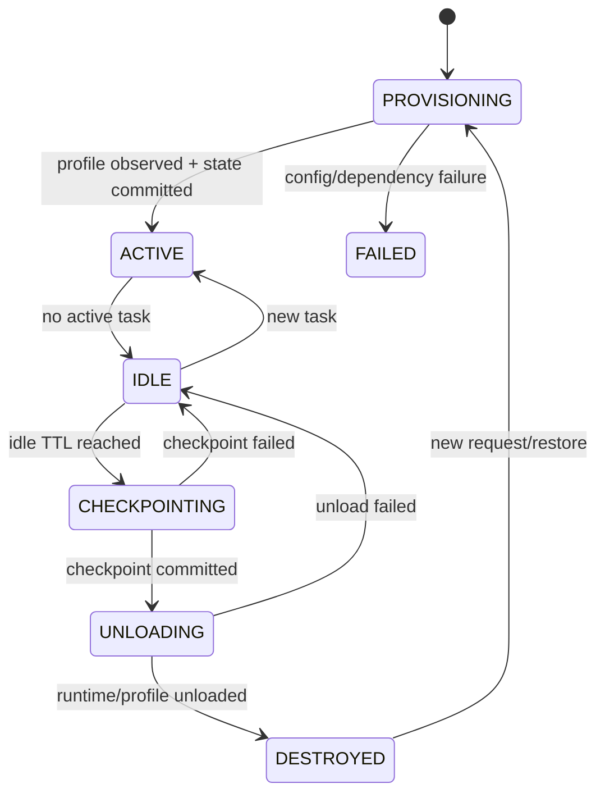
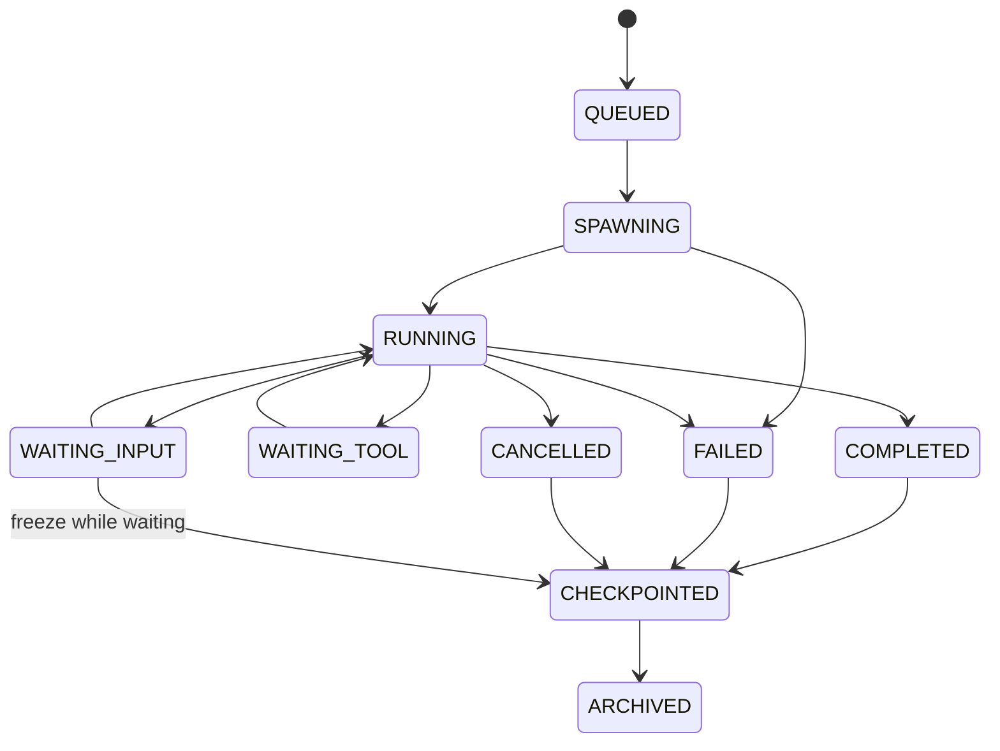

# Agent 生命周期、持久化与恢复

## 1. 核心语义

本项目中的“销毁”定义为：

> 完成 checkpoint 后，从活跃运行时和 OpenClaw 活跃 Profile/Session 中卸载，不删除历史 Session、Memory、Trace、TaskState、Artifact 和审计记录。

为了避免歧义，代码和状态机优先使用：

```text
checkpoint
archive
unload
destroy runtime
restore
```

而不是笼统的 `delete`。

---

## 2. 生命周期参数

默认 Demo 参数：

```text
L1 TenantBizAgent idle TTL = 86400 seconds (24h)
L2 TaskAgent idle TTL      = 3600 seconds (1h)
```

所有 TTL 必须：

- 可以按 tenant/biz 配置；
- 可以通过环境变量覆盖；
- 测试中使用 fake clock；
- 存储为秒或绝对 UTC 时间；
- 不依赖进程内 `setTimeout` 作为唯一触发机制。

OpenClaw 原生 Sub-agent auto-archive 可保留为辅助，但数据库驱动 Reaper 是权威机制。

---

## 3. 活跃时间定义

### 3.1 L1 last_active_at

以下行为更新 L1 `last_active_at`：

- 接收新业务任务；
- 派生 L2；
- 接收 L2 完成/失败 announce；
- 用户对该 L1 的有效后续交互；
- 恢复未完成任务；
- 执行有业务意义的 Tool/Memory 写入。

以下行为不得延长空闲时间：

- health check；
- metrics scrape；
- Reaper 扫描；
- 单纯读取 Agent 状态；
- 后台审计补写；
- Session store 维护时间戳变化。

### 3.2 L2 last_active_at

以下行为更新 L2：

- 开始/结束一个 step；
- Tool 调用开始/结束；
- 等待 Tool 后恢复；
- 接收用户补充输入；
- 写 checkpoint。

任务 `COMPLETED` 后应立即 checkpoint，归档可随后进行，不需要继续保留一小时内存对象。

---

## 4. L1 状态机



### 4.1 L1 卸载前置条件

必须同时满足：

```text
now - last_active_at >= l1_idle_ttl
active_l2_count == 0
no task in RUNNING / SPAWNING / WAITING_TOOL / CHECKPOINTING
runtime heartbeat is stale or instance agrees to checkpoint
distributed unload lock acquired
```

### 4.2 L1 final checkpoint

按顺序：

1. 状态 CAS：`IDLE → CHECKPOINTING`；
2. 禁止新 L2 spawn；
3. flush pending Trace/Outbox；
4. 生成 Session Summary；
5. 复制/归档 Transcript 到 MinIO；
6. 计算 Transcript hash；
7. flush Memory delta；
8. 保存当前 Task index；
9. 保存 Capability Snapshot reference；
10. 写 checkpoint record；
11. 事务提交；
12. 状态切换 `UNLOADING`；
13. 从 OpenClaw 配置/Runtime 卸载 Profile；
14. 验证 Profile 已不可调度；
15. 标记 Runtime Instance `DESTROYED`。

任一步在第 11 步前失败：保持或恢复 `IDLE`，禁止卸载。

第 13—14 步失败：状态进入 `UNLOAD_FAILED` 或恢复 `IDLE`，由 Reaper 重试。不能把数据库标记为 DESTROYED 后仍保留活跃 Profile。

---

## 5. L2 状态机



### 5.1 完成任务

L2 完成后立即：

- 保存 final result；
- 保存 step state；
- 保存 Tool Call index；
- 保存 Transcript URI/hash；
- 保存 Task Memory delta；
- 写 completion Trace；
- 标记 `CHECKPOINTED`。

OpenClaw Session 可以在后续 Reaper 或 auto-archive 中归档。

### 5.2 等待用户输入

`WAITING_INPUT` 不应该让 L2 内存对象长期常驻。进入等待状态时：

1. checkpoint；
2. 保存 resume instructions；
3. 允许 Session/Runtime archive；
4. 新输入到来时创建新运行实例或恢复 Session；
5. 重新签发 Token，不能沿用过期 Token。

---

## 6. 权威存储模型

### 6.1 tenant_biz_agent

```text
logical_agent_id PK
tenant_id
biz_domain
status
current_runtime_instance_id
current_capability_snapshot_id
last_active_at
created_at
updated_at
UNIQUE(tenant_id, biz_domain)
```

### 6.2 agent_runtime_instance

```text
runtime_instance_id PK
logical_agent_id
openclaw_agent_id
status
capability_snapshot_id
started_at
last_active_at
checkpointed_at
destroyed_at
restored_from_runtime_instance_id
failure_code
```

### 6.3 agent_task_state

```text
task_id PK
tenant_id
biz_domain
logical_agent_id
runtime_instance_id
l2_session_id
task_type
status
current_step
step_state JSONB
input_ref/result_ref
idempotency_key
trace_id
last_active_at
created_at
updated_at
UNIQUE(tenant_id, biz_domain, idempotency_key)
```

### 6.4 agent_session_snapshot

```text
snapshot_id PK
tenant_id
biz_domain
logical_agent_id
runtime_instance_id
session_id
summary
transcript_uri
transcript_sha256
last_message_offset
created_at
```

### 6.5 agent_memory

```text
memory_id PK
tenant_id
biz_domain
logical_agent_id
session_id
task_id
memory_type
visibility
resource_type
resource_id
content_summary
content_ref
vector_ref
content_hash
created_at
```

### 6.6 agent_trace_event

```text
event_id PK
trace_id
tenant_id
biz_domain
logical_agent_id
runtime_instance_id
session_id
task_id
event_type
payload JSONB
previous_hash
event_hash
created_at
```

---

## 7. MinIO 对象布局

推荐：

```text
agentnest-state/
  tenants/<tenant-hash>/
    biz/<biz-domain>/
      agents/<logical-agent-id>/
        runtime/<runtime-instance-id>/
          sessions/<session-id>/transcript.jsonl
          sessions/<session-id>/summary.json
          tasks/<task-id>/checkpoint.json
          tasks/<task-id>/result.json
          artifacts/...
```

`tenant-hash` 只是路径标识，不替代数据库授权。对象读取必须经服务校验。

每次写入保存：

- content type；
- size；
- SHA-256；
- encryption metadata（如果启用）；
- database owner reference。

---

## 8. Reaper 设计

### 8.1 数据库驱动

Reaper 周期扫描 PostgreSQL：

```sql
SELECT ...
FROM agent_runtime_instance
WHERE status IN ('ACTIVE', 'IDLE')
  AND last_active_at < :cutoff
FOR UPDATE SKIP LOCKED;
```

实际查询应区分 L1 和 L2。

### 8.2 分布式安全

- 使用 PostgreSQL row lock 或 Redis lock；
- lock value 包含 reaper instance id；
- lock 有 TTL 和续租；
- 状态转换使用 compare-and-set；
- 多 Reaper 并发不能重复 checkpoint/unload；
- 重试使用指数退避；
- 每次运行有限 batch，避免长事务。

### 8.3 重启恢复

Reaper 启动时扫描中间状态：

```text
CHECKPOINTING
UNLOADING
CHECKPOINT_FAILED
UNLOAD_FAILED
```

根据 checkpoint record 和 OpenClaw observed state 决定继续、回滚或重试。

---

## 9. 恢复算法

收到新任务时：

1. 根据 `tenant_id + biz_domain` 获取 logical agent；
2. 读取当前最新 tenant policy；
3. 创建新的 Capability Snapshot；
4. 如果已有健康 ACTIVE runtime，复用；
5. 否则创建新 `runtime_instance_id`；
6. 读取最后成功 checkpoint；
7. 重建 workspace/Skill materialization；
8. 创建/激活 OpenClaw Profile；
9. 验证 observed `workspace/agentDir/skills/tools/sandbox`；
10. 加载 Session Summary 和任务相关 Memory；
11. 不加载完整历史 Transcript，除非显式诊断；
12. 对未完成任务恢复 current_step；
13. 重新签发 L2 Token；
14. 写 `RESTORE_COMPLETED`；
15. 设置 `restored_from_runtime_instance_id`。

---

## 10. 权限变化与恢复

必须遵守：

```text
历史 Snapshot = 审计事实
最新 Policy = 新运行授权事实
```

恢复时：

- 不能直接重新使用旧 Snapshot 作为授权；
- 重新解析最新 Policy；
- 旧任务要求的能力被撤销时，任务进入 `BLOCKED_POLICY_CHANGED`；
- 不能静默补回权限；
- 记录新旧 Snapshot diff；
- 等待业务方重新授权或取消任务。

---

## 11. 一致性和幂等

### 11.1 Outbox

关键状态 + Trace/事件采用同事务 Outbox：

```text
write state + outbox event in PostgreSQL transaction
publisher asynchronously sends to MinIO/metrics/other consumers
mark outbox delivered
```

### 11.2 checkpoint idempotency

Checkpoint key：

```text
runtime_instance_id + session_id + checkpoint_sequence
```

重复执行返回同一 snapshot，不生成冲突对象。

### 11.3 unload idempotency

对已 DESTROYED 实例重复 unload 返回成功的当前状态，不报不可恢复错误。

---

## 12. 故障行为

| 故障 | 必须行为 |
|---|---|
| PostgreSQL 不可用 | 不接收新任务，不卸载任何运行态 |
| Redis 不可用 | 可降级到 PostgreSQL lock，或 readiness=false；不得无锁并发 ensure |
| MinIO 不可用 | checkpoint 失败；保留运行态/任务状态，不标记完成归档 |
| OpenClaw config reload 失败 | L1 不标记 ACTIVE，保留 last-known-good |
| OpenClaw Gateway 重启 | 从 PostgreSQL reconciliation，不依赖旧 timer |
| Control Plane 重启 | 恢复 Registry，reconcile observed profiles |
| Tool Gateway 超时 | Task 进入可重试状态，Trace 记录，不重复写副作用 |
| Token signing key 缺失 | readiness=false，拒绝任务 |

---

## 13. 生命周期验证必须使用测试时钟

测试时钟接口：

```ts
interface Clock {
  now(): Date;
}

interface MutableTestClock extends Clock {
  advance(durationMs: number): void;
}
```

所有 TTL 逻辑只依赖注入的 `Clock`。禁止直接在领域服务调用 `Date.now()`。

远端 E2E 通过 Admin test-clock：

```text
advance 3599s → L2 未归档
advance 1s    → L2 成为候选并归档
advance 86399s → L1 未卸载
advance 1s     → L1 成为候选并卸载
```

测试结束恢复时钟或重建 Demo 环境，避免污染后续场景。
