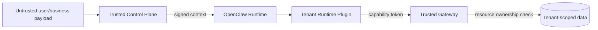

# 安全与隔离设计

## 1. 安全目标

AgentNest Demo 必须证明以下隔离不是“模型自觉”，而是系统强制：

1. tenant_A 无法读取、推断或修改 tenant_B 的数据和 Memory；
2. 同一租户的 LEGAL 无法读取或调用 ROBOT_DOG 的 Skill、Tool、Memory；
3. L2 无法获得 L1 未授权能力；
4. 模型伪造 `tenant_id`、`biz_domain` 或 Tool 参数不能绕过控制面；
5. 旧 Session、旧 Snapshot、旧 Token 不能复活被撤销权限；
6. OpenClaw 插件失误时，Gateway 仍能拒绝越权请求；
7. 用户输入、Skill 文本、Tool 返回中的提示注入不能改变可信授权上下文。

---

## 2. 威胁模型

### 2.1 不可信来源

默认将以下内容视为不可信：

- 用户 Prompt；
- 业务服务提交的 body 字段；
- Agent 生成的参数；
- Skill 内容和说明；
- Tool 返回文本；
- External API 返回；
- Memory 中的自然语言；
- Session Transcript；
- 文件名、对象 key、resource_id；
- 从 ClawHub 或外部下载的扩展。

### 2.2 受保护资产

- 租户数据；
- 业务 Memory；
- Session/Transcript；
- Skill/Tool 可见性；
- Capability Snapshot；
- Capability Token；
- 模型与外部服务凭证；
- OpenClaw workspace/agentDir；
- Trace/Audit 完整性；
- 远端云服务器。

### 2.3 主要攻击

- Body 中伪造另一个 tenant；
- Prompt 要求模型“忽略限制”；
- L2 请求未授权 Tool；
- 使用允许的 Tool 名称但调用未授权 action；
- Path traversal 访问另一个 Agent workspace；
- 复用另一个 Session 的 Token；
- 重放旧 Tool 请求；
- Token 过期后继续使用；
- Snapshot 回滚导致已撤销权限复活；
- Memory 向量搜索跨租户召回；
- 通过共享全局插件存储泄漏；
- 配置热更新竞态创建两个 L1；
- checkpoint 失败后仍销毁运行态；
- 日志输出 config.txt、模型 key 或 Capability Token。

---

## 3. 信任边界



可信身份仅能由 Control Plane 认证/映射后生成。OpenClaw 和模型不能自行声明可信租户。

---

## 4. 隔离层级

## 4.1 L1 Profile 隔离

每个 `tenant_id + biz_domain`：

- 独立 `agentId`；
- 独立 workspace；
- 独立 agentDir；
- 独立 Session Store；
- 独立 Skill allowlist；
- 独立 Tool policy；
- 独立 Memory namespace；
- 独立 Sandbox scope。

禁止：

- 共享 agentDir；
- workspace 使用可控原始租户名直接构造；
- 使用软链接跳到其他 workspace；
- 配置全局 Memory Wiki 后误认为自动隔离；
- 在一个全局 Agent 内仅用 Prompt 标注 tenant。

## 4.2 L2 Session 隔离

- 默认 `context=isolated`；
- Token 绑定 L2 `session_id` 和 `task_id`；
- L2 无法访问其他 L2 Transcript；
- L2 不拥有配置管理和 Gateway 管理 Tool；
- L2 不能派生更多层级；
- L2 的文件访问限制在当前 sandbox/workspace 和 resource scope。

## 4.3 存储隔离

所有查询在 DAO/SQL 层强制：

```sql
WHERE tenant_id = :tenant_id
  AND biz_domain = :biz_domain
```

资源查询再加：

```sql
AND resource_type = :resource_type
AND resource_id = :resource_id
```

禁止把全量查询结果取回后在应用层过滤。

---

## 5. Skill 隔离

OpenClaw per-agent Skill allowlist 是 L1 Skill 可见性的第一层控制。

要求：

- L1 使用显式最终 allowlist；
- 无授权 Skill 时设置 `[]`；
- workspace 只同步允许的 Skill；
- Skill manifest 包含 name、version、hash、required tools；
- 启动时校验实际 Skill hash 与 Snapshot 一致；
- Skill 需要的 Tool 不在允许列表时，Skill 不得启用；
- Demo 禁止在线安装未经审核 Skill；
- Skill 不得直接读取模型/数据库/MinIO 管理凭证。

测试必须尝试：

- LEGAL Agent 枚举 ROBOT_DOG Skill；
- 直接通过 slash command 调未授权 Skill；
- 在 Prompt 中写出 Skill 名称要求加载；
- 将未授权 Skill 文件手工放到共享根后重启。

预期均不可见或执行被拒绝。

---

## 6. Tool 隔离

### 6.1 模型可见性层

Tenant Runtime Plugin 根据：

```text
agent_id + session_id + capability_snapshot_id
```

生成最终 Tool Registry View。

### 6.2 执行前层

插件再次检查：

```text
tool_name
action
session_id
task_id
snapshot_id
```

### 6.3 Gateway 强校验层

Gateway 验证：

- 签名；
- issuer/audience；
- expiry/not-before；
- jti/nonce；
- token revoke；
- tenant/biz；
- logical/runtime Agent；
- session/task；
- tool/action；
- data/resource scope；
- idempotency/replay。

### 6.4 资源归属层

即使 Token 允许 `legal.case.read`，也只能读取 Token scope 中明确允许的 case。

禁止使用：

```text
tool allowed => all resources allowed
```

---

## 7. Memory 隔离

Memory 至少分：

```text
TENANT_BIZ_MEMORY
USER_MEMORY
RESOURCE_MEMORY
TASK_MEMORY
SESSION_SUMMARY
```

每条 Memory 必须有：

```text
tenant_id
biz_domain
visibility
resource_type
resource_id
owner_user_id
content_hash
```

### 7.1 向量检索

过滤必须进入向量数据库查询表达式：

```text
tenant_id == current_tenant
AND biz_domain == current_biz
AND visibility in allowed_visibility
AND resource scope matches token
```

不允许：

1. 全局 top-k；
2. 返回应用；
3. 再按 tenant 过滤。

### 7.2 Session 恢复

恢复时不得加载其他租户或其他业务域 Session Summary。查询必须使用 tenant+biz+logical_agent_id。

### 7.3 Canary 测试

为每个 tenant/biz 写唯一 canary：

```text
TENANT_A_LEGAL_SECRET_CANARY
TENANT_A_ROBOT_SECRET_CANARY
TENANT_B_LEGAL_SECRET_CANARY
```

精确搜索、模糊搜索、向量语义搜索、Session recall 都必须只返回当前 scope 的 canary。

---

## 8. Capability Token 安全

推荐 JWT/JWS 或 PASETO 等带签名格式，Demo 允许 HMAC，但必须：

- 使用至少 256-bit 随机密钥；
- 从 config.txt/secret file 注入；
- 短 TTL；
- audience 限制；
- jti/nonce；
- 绑定 session/task；
- 不允许 body 覆盖 claims；
- 日志只记录 token hash/jti，不记录完整 token。

Token replay 测试：同一写 action 和同一 idempotency key 只产生一次副作用。对于一次性操作，可把 jti 标记为已使用。

---

## 9. 文件系统与 Sandbox

- 非 Main Agent 默认 sandbox `mode=all`、`scope=agent`；
- L1/L2 默认禁止 `exec`，除非 Demo 必需并有明确 allowlist；
- 禁止 mount Docker socket；
- 禁止 mount 宿主 `/`, `/home`, `/root`, `/var/run`；
- workspace path 由稳定 hash ID 生成；
- 对所有 path 做 `realpath`，确认仍在允许根目录；
- 拒绝 `..`、绝对路径、symlink escape；
- MinIO object key 由 Gateway 构造，不完全信任模型给出的 key；
- 每租户业务对象前缀或数据库映射必须经过资源归属校验。

---

## 10. 网络隔离

- OpenClaw Gateway 默认 loopback；
- PostgreSQL、Redis、MinIO 仅 Docker 私网/loopback；
- Admin API 仅 loopback；
- 对外 Demo API 使用 Bearer Token；
- 远端验证使用 SSH tunnel；
- 禁止 `0.0.0.0` 暴露数据库、Redis、MinIO Console 或 OpenClaw UI；
- External Gateway Mock 只允许预定义目标，不提供任意 URL fetch；
- 防止 SSRF：拒绝 loopback、link-local、metadata IP、私网目标，除非明确 allowlist。

---

## 11. 配置和凭证

- `config.txt`、`.env`、私钥均被 Git 忽略；
- config 解析器不得在异常中输出原值；
- 调试日志必须 mask：password、secret、token、api_key、authorization、cookie；
- 子进程环境只注入最小凭证；
- L2 不获得数据库、MinIO、外部 API 管理凭证；
- Tool 只能经 Gateway；
- 提交前运行 secret scanner；
- 测试报告对 Token 只显示前后各 4 位或 hash。

---

## 12. 审计与不可抵赖性

每次拒绝至少记录：

```text
trace_id
audit_id
tenant_id
biz_domain
agent_id
session_id
task_id
tool_name
action
decision=DENY
reason_code
policy_version
snapshot_id
timestamp
```

不记录完整敏感参数。对写操作，可记录 input hash、resource id 和 result hash。

Trace 可以使用 hash chain 增强防篡改：

```text
event_hash = sha256(previous_hash + canonical_event)
```

Demo 最低要求是事件不可静默丢失，并能按 trace_id 查询完整链路。

---

## 13. 安全测试必须验证副作用

错误的测试：

```text
看到返回“拒绝”就算成功
```

正确测试：

1. 记录目标资源原状态；
2. 发起越权请求；
3. 断言返回拒绝；
4. 重新查询目标资源，断言没有变化；
5. 查询 Audit，断言有 DENY 事件；
6. 查询 Trace，断言可关联到原请求；
7. 断言没有生成未授权 MinIO object 或 Memory。

---

## 14. 安全验收矩阵

| 场景 | 预期 |
|---|---|
| tenant_A Token + tenant_B body | 以 Token 为准并拒绝资源越权 |
| LEGAL Token 调 robot.device.read | CAPABILITY_DENIED |
| Tool 允许但 action 不允许 | ACTION_DENIED |
| Token session 与当前 session 不同 | TOKEN_CONTEXT_MISMATCH |
| Token 过期 | TOKEN_EXPIRED |
| Token 签名被改 | TOKEN_INVALID |
| 被撤销 Snapshot 恢复 | 新 Snapshot 不包含权限 |
| 全局 Memory canary 搜索 | 只返回当前 tenant+biz |
| workspace `../` | PATH_SCOPE_DENIED |
| 重复写 Tool 调用 | 一个副作用，重复返回幂等结果 |
| checkpoint 失败后 Reaper | 保留运行态，不标记 DESTROYED |
