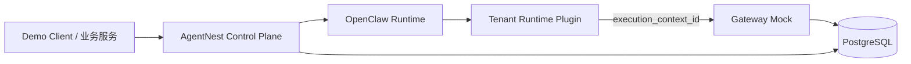

# Demo 安全与隔离基线

## 1. 目的

AgentNest 第一版只需要证明：

1. 不同 `tenant_id + biz_domain` 的 Agent、Skill、Tool、Memory、Session 不混用；
2. L2 不能获得 L1 没有的能力；
3. 越权 Tool 调用不会修改其他租户或业务的数据；
4. 本地和云端 Demo 不泄露 `config.txt`、模型 Key 或 SSH 凭证。

本文件不是生产安全规范。它只定义完成 Demo 所需的最小安全边界。

---

## 2. 信任边界



规则：

- Client、Prompt 和模型生成的参数都不能直接决定可信 tenant/biz；
- Control Plane 创建权威 `execution_context`；
- Gateway Mock 根据 `execution_context_id` 查询服务端上下文；
- Gateway 依据服务端上下文校验 Tool、action 和资源归属。

第一版不使用签名 Capability Token。

---

## 3. L1 Profile 隔离

每个 `(tenant_id, biz_domain)` 必须有独立：

```text
agentId
workspace
agentDir
Session namespace/store
Skill allowlist
Tool allowlist
Memory namespace
```

禁止：

- 两个 L1 共用 `agentDir`；
- 在一个全局 Agent 内只靠 Prompt 写“当前租户”；
- 使用未经规范化的 tenant_id 直接拼路径；
- 使用软链接跳到其他租户 workspace。

推荐路径：

```text
runtime/tenants/<logical_agent_id>/workspace
runtime/tenants/<logical_agent_id>/agent
runtime/tenants/<logical_agent_id>/sessions
```

`logical_agent_id` 由规范化 tenant/biz 的稳定 hash 生成。

---

## 4. L2 权限继承

L2 由 L1 通过 `sessions_spawn` 创建。

L2 实际能力使用普通集合交集：

```text
L2.skills       = L1.skills ∩ task_template.skills
L2.tools        = L1.tools ∩ task_template.tools
L2.tool_actions = L1.tool_actions ∩ task_template.tool_actions
L2.memory_scope = L1.memory_scope ∩ task_template.memory_scope
```

创建 L2 前必须断言：

```text
L2.skills       ⊆ L1.skills
L2.tools        ⊆ L1.tools
L2.tool_actions ⊆ L1.tool_actions
L2.memory_scope ⊆ L1.memory_scope
```

不需要设计通用 Policy DSL、权限委派协议或短期签名 Token。

---

## 5. Skill 隔离

要求：

- L1 使用显式最终 Skill allowlist；
- LEGAL 只加载法律 Demo Skill；
- ROBOT_DOG 只加载机器狗 Demo Skill；
- L2 只加载任务模板需要且父级允许的 Skill；
- Prompt 中写出未授权 Skill 名称不能使其加载；
- Demo Skill 随仓库版本管理。

Demo 不要求：

- Skill 内容密码学签名；
- 在线 Skill 商店；
- 供应链扫描平台；
- 复杂 Skill revoke/rollout 系统。

---

## 6. Tool 隔离

### 6.1 模型可见性

OpenClaw Agent Profile/Plugin 只向模型暴露 allowlist 中的 Tool。

### 6.2 服务端执行上下文

控制面创建：

```json
{
  "execution_context_id": "uuid",
  "tenant_id": "tenant_A",
  "biz_domain": "LEGAL",
  "logical_agent_id": "tb_xxx",
  "runtime_instance_id": "ari_xxx",
  "session_id": "session_xxx",
  "task_id": "task_xxx",
  "allowed_tools": {
    "legal_case_read": ["read"],
    "legal_analysis_write": ["write"]
  },
  "resource_scope": {
    "resource_type": "CASE",
    "resource_ids": ["case_001"]
  },
  "expires_at": "..."
}
```

该记录保存在 PostgreSQL。

Plugin/Adapter 调 Gateway Mock 时发送：

```json
{
  "execution_context_id": "uuid",
  "tool_name": "legal_case_read",
  "action": "read",
  "resource": {
    "resource_type": "CASE",
    "resource_id": "case_001"
  },
  "params": {}
}
```

Gateway Mock 必须：

1. 查询 `execution_context_id`；
2. 检查未过期；
3. 检查 `tool_name + action`；
4. 检查 resource 在允许范围；
5. 使用上下文中的 tenant/biz 查询数据；
6. 忽略或拒绝 body 中试图覆盖 tenant/biz 的字段；
7. 写简单 ALLOW/DENY Trace。

这比相信模型 body 更可靠，同时比 JWT/PASETO 简单很多，适合 Demo。

---

## 7. Memory 隔离

第一版 Memory 使用 PostgreSQL。

每条记录至少包含：

```text
memory_id
tenant_id
biz_domain
logical_agent_id
session_id
task_id
memory_type
content
created_at
```

所有查询必须包含：

```sql
WHERE tenant_id = :tenant_id
  AND biz_domain = :biz_domain
```

资源级 Memory 再加 `resource_type + resource_id`。

禁止：

- 全局读取后在应用层过滤；
- 跨租户 fallback；
- 同租户 LEGAL 与 ROBOT_DOG 共用 Memory namespace。

第一版不要求向量数据库或语义召回。Memory Canary 使用精确文本查询即可验证隔离。

---

## 8. Session、Trace 与业务数据

Session、Trace、Task 和 Demo 业务资源都必须保存 `tenant_id + biz_domain`。

Repository API 应要求显式 `TenantBizScope`，避免只按 `task_id`、`session_id` 或 `resource_id` 查询。

Trace 最低字段：

```text
trace_id
tenant_id
biz_domain
logical_agent_id
session_id
task_id
event_type
decision
reason
created_at
```

Demo 不要求 hash chain、不可抵赖或外部审计系统。

---

## 9. 路径安全

最低要求：

- 路径基于稳定 hash ID；
- 通过 `resolve/realpath` 确认最终路径仍在运行根目录；
- 拒绝 `..` 和绝对路径输入；
- 禁止 mount Docker socket；
- 不把宿主 `/root`、`/home` 或 `/` 挂入 Agent workspace；
- Agent 不直接获得 PostgreSQL 管理凭证。

不建设完整 Sandbox 平台；优先使用 OpenClaw stable 已提供的 per-agent sandbox 配置。

---

## 10. 配置与网络

- `config.txt`、`.env`、SSH 私钥、模型/API Key 必须 Git ignore；
- 日志不得输出密码、私钥、完整 Key 或连接串；
- OpenClaw、PostgreSQL、Admin/Test API 默认 loopback 或 Docker 私网；
- 对外 Demo API 可以使用一个静态 Demo Bearer Token，也可以仅通过 SSH tunnel 访问；
- 远端脚本只操作 `REMOTE_WORKDIR` 和本项目资源。

不要求 OAuth、mTLS、PKI、WAF 或完整 IAM。

---

## 11. 必测安全场景

| 场景 | 预期 |
|---|---|
| tenant_A/LEGAL 读取 tenant_B/LEGAL 的 `case_001` | 拒绝，tenant_B 数据不变 |
| LEGAL L2 调 `robot_device_read` | 拒绝 |
| ROBOT_DOG L2 调 `legal_case_read` | 拒绝 |
| Tool 允许但 action 不允许 | 拒绝 |
| 未知或过期 execution context | 拒绝 |
| Prompt 写出未授权 Skill 名称 | Skill 不可见/不可执行 |
| tenant_A/LEGAL 查询 Memory | 只返回本 scope |
| workspace 输入 `../` | 拒绝 |
| checkpoint 持久化失败 | 不标记 UNLOADED |

每个 Tool 越权测试至少验证：

1. 请求被拒绝；
2. 目标业务数据无变化；
3. Trace 中存在 `DENY` 和原因。

---

## 12. 明确推迟到生产化阶段

以下内容不属于 Demo：

```text
Capability Token/JWT/PASETO
Token nonce/revoke/rotation
PKI/mTLS/零信任网络
OAuth/完整 RBAC
Redis 分布式锁
Kafka/Outbox
MinIO
向量数据库
审计 hash chain
多节点 HA
Kubernetes
全面 SSRF/WAF/供应链平台
生产计费与配额
```

后续可以在 `docs/production-hardening.md` 中列建议，但 Codex 不得提前实现并阻塞 Demo。
